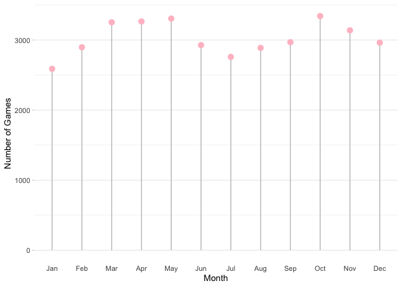

Mini Data-Analysis Deliverable 1
================

# Welcome to your (maybe) first-ever data analysis project!

And hopefully the first of many. Let’s get started:

1.  Install the [`datateachr`](https://github.com/UBC-MDS/datateachr)
    package by typing the following into your **R terminal**:

<!-- -->

    install.packages("devtools")
    devtools::install_github("UBC-MDS/datateachr")

2.  Load the packages below.

``` r
library(datateachr)
library(tidyverse)
```

    ## ── Attaching core tidyverse packages ──────────────────────── tidyverse 2.0.0 ──
    ## ✔ dplyr     1.1.3     ✔ readr     2.1.4
    ## ✔ forcats   1.0.0     ✔ stringr   1.5.0
    ## ✔ ggplot2   3.4.3     ✔ tibble    3.2.1
    ## ✔ lubridate 1.9.2     ✔ tidyr     1.3.0
    ## ✔ purrr     1.0.2     
    ## ── Conflicts ────────────────────────────────────────── tidyverse_conflicts() ──
    ## ✖ dplyr::filter() masks stats::filter()
    ## ✖ dplyr::lag()    masks stats::lag()
    ## ℹ Use the conflicted package (<http://conflicted.r-lib.org/>) to force all conflicts to become errors

3.  Make a repository in the <https://github.com/stat545ubc-2023>
    Organization. You can do this by following the steps found on canvas
    in the entry called [MDA: Create a
    repository](https://canvas.ubc.ca/courses/126199/pages/mda-create-a-repository).
    One completed, your repository should automatically be listed as
    part of the stat545ubc-2023 Organization.

# Instructions

## For Both Milestones

- Each milestone has explicit tasks. Tasks that are more challenging
  will often be allocated more points.

- Each milestone will be also graded for reproducibility, cleanliness,
  and coherence of the overall Github submission.

- While the two milestones will be submitted as independent
  deliverables, the analysis itself is a continuum - think of it as two
  chapters to a story. Each chapter, or in this case, portion of your
  analysis, should be easily followed through by someone unfamiliar with
  the content.
  [Here](https://swcarpentry.github.io/r-novice-inflammation/06-best-practices-R/)
  is a good resource for what constitutes “good code”. Learning good
  coding practices early in your career will save you hassle later on!

- The milestones will be equally weighted.

## For Milestone 1

**To complete this milestone**, edit [this very `.Rmd`
file](https://raw.githubusercontent.com/UBC-STAT/stat545.stat.ubc.ca/master/content/mini-project/mini-project-1.Rmd)
directly. Fill in the sections that are tagged with
`<!--- start your work below --->`.

**To submit this milestone**, make sure to knit this `.Rmd` file to an
`.md` file by changing the YAML output settings from
`output: html_document` to `output: github_document`. Commit and push
all of your work to the mini-analysis GitHub repository you made
earlier, and tag a release on GitHub. Then, submit a link to your tagged
release on canvas.

**Points**: This milestone is worth 36 points: 30 for your analysis, and
6 for overall reproducibility, cleanliness, and coherence of the Github
submission.

# Learning Objectives

By the end of this milestone, you should:

- Become familiar with your dataset of choosing
- Select 4 questions that you would like to answer with your data
- Generate a reproducible and clear report using R Markdown
- Become familiar with manipulating and summarizing your data in tibbles
  using `dplyr`, with a research question in mind.

# Task 1: Choose your favorite dataset

The `datateachr` package by Hayley Boyce and Jordan Bourak currently
composed of 7 semi-tidy datasets for educational purposes. Here is a
brief description of each dataset:

- *apt_buildings*: Acquired courtesy of The City of Toronto’s Open Data
  Portal. It currently has 3455 rows and 37 columns.

- *building_permits*: Acquired courtesy of The City of Vancouver’s Open
  Data Portal. It currently has 20680 rows and 14 columns.

- *cancer_sample*: Acquired courtesy of UCI Machine Learning Repository.
  It currently has 569 rows and 32 columns.

- *flow_sample*: Acquired courtesy of The Government of Canada’s
  Historical Hydrometric Database. It currently has 218 rows and 7
  columns.

- *parking_meters*: Acquired courtesy of The City of Vancouver’s Open
  Data Portal. It currently has 10032 rows and 22 columns.

- *steam_games*: Acquired courtesy of Kaggle. It currently has 40833
  rows and 21 columns.

- *vancouver_trees*: Acquired courtesy of The City of Vancouver’s Open
  Data Portal. It currently has 146611 rows and 20 columns.

**Things to keep in mind**

- We hope that this project will serve as practice for carrying our your
  own *independent* data analysis. Remember to comment your code, be
  explicit about what you are doing, and write notes in this markdown
  document when you feel that context is required. As you advance in the
  project, prompts and hints to do this will be diminished - it’ll be up
  to you!

- Before choosing a dataset, you should always keep in mind **your
  goal**, or in other ways, *what you wish to achieve with this data*.
  This mini data-analysis project focuses on *data wrangling*,
  *tidying*, and *visualization*. In short, it’s a way for you to get
  your feet wet with exploring data on your own.

And that is exactly the first thing that you will do!

1.1 **(1 point)** Out of the 7 datasets available in the `datateachr`
package, choose **4** that appeal to you based on their description.
Write your choices below:

**Note**: We encourage you to use the ones in the `datateachr` package,
but if you have a dataset that you’d really like to use, you can include
it here. But, please check with a member of the teaching team to see
whether the dataset is of appropriate complexity. Also, include a
**brief** description of the dataset here to help the teaching team
understand your data.

<!-------------------------- Start your work below ---------------------------->

1.  steam_games
2.  vancouver_trees  
3.  cancer_sample  
4.  apt_buildings

<!----------------------------------------------------------------------------->

1.2 **(6 points)** One way to narrowing down your selection is to
*explore* the datasets. Use your knowledge of dplyr to find out at least
*3* attributes about each of these datasets (an attribute is something
such as number of rows, variables, class type…). The goal here is to
have an idea of *what the data looks like*.

*Hint:* This is one of those times when you should think about the
cleanliness of your analysis. I added a single code chunk for you below,
but do you want to use more than one? Would you like to write more
comments outside of the code chunk?

<!-------------------------- Start your work below ---------------------------->

So to look at many different dataset attributes at the same time we can
use the the `glimpse()` function from the `dplyr` package to see: number
of rows, number of columns, column names and types as well as some of
the entries in each of the columns.

``` r
### EXPLORE HERE ###
glimpse(steam_games)
```

    ## Rows: 40,833
    ## Columns: 21
    ## $ id                       <dbl> 1, 2, 3, 4, 5, 6, 7, 8, 9, 10, 11, 12, 13, 14…
    ## $ url                      <chr> "https://store.steampowered.com/app/379720/DO…
    ## $ types                    <chr> "app", "app", "app", "app", "app", "bundle", …
    ## $ name                     <chr> "DOOM", "PLAYERUNKNOWN'S BATTLEGROUNDS", "BAT…
    ## $ desc_snippet             <chr> "Now includes all three premium DLC packs (Un…
    ## $ recent_reviews           <chr> "Very Positive,(554),- 89% of the 554 user re…
    ## $ all_reviews              <chr> "Very Positive,(42,550),- 92% of the 42,550 u…
    ## $ release_date             <chr> "May 12, 2016", "Dec 21, 2017", "Apr 24, 2018…
    ## $ developer                <chr> "id Software", "PUBG Corporation", "Harebrain…
    ## $ publisher                <chr> "Bethesda Softworks,Bethesda Softworks", "PUB…
    ## $ popular_tags             <chr> "FPS,Gore,Action,Demons,Shooter,First-Person,…
    ## $ game_details             <chr> "Single-player,Multi-player,Co-op,Steam Achie…
    ## $ languages                <chr> "English,French,Italian,German,Spanish - Spai…
    ## $ achievements             <dbl> 54, 37, 128, NA, NA, NA, 51, 55, 34, 43, 72, …
    ## $ genre                    <chr> "Action", "Action,Adventure,Massively Multipl…
    ## $ game_description         <chr> "About This Game Developed by id software, th…
    ## $ mature_content           <chr> NA, "Mature Content Description  The develope…
    ## $ minimum_requirements     <chr> "Minimum:,OS:,Windows 7/8.1/10 (64-bit versio…
    ## $ recommended_requirements <chr> "Recommended:,OS:,Windows 7/8.1/10 (64-bit ve…
    ## $ original_price           <dbl> 19.99, 29.99, 39.99, 44.99, 0.00, NA, 59.99, …
    ## $ discount_price           <dbl> 14.99, NA, NA, NA, NA, 35.18, 70.42, 17.58, N…

``` r
glimpse(vancouver_trees)
```

    ## Rows: 146,611
    ## Columns: 20
    ## $ tree_id            <dbl> 149556, 149563, 149579, 149590, 149604, 149616, 149…
    ## $ civic_number       <dbl> 494, 450, 4994, 858, 5032, 585, 4909, 4925, 4969, 7…
    ## $ std_street         <chr> "W 58TH AV", "W 58TH AV", "WINDSOR ST", "E 39TH AV"…
    ## $ genus_name         <chr> "ULMUS", "ZELKOVA", "STYRAX", "FRAXINUS", "ACER", "…
    ## $ species_name       <chr> "AMERICANA", "SERRATA", "JAPONICA", "AMERICANA", "C…
    ## $ cultivar_name      <chr> "BRANDON", NA, NA, "AUTUMN APPLAUSE", NA, "CHANTICL…
    ## $ common_name        <chr> "BRANDON ELM", "JAPANESE ZELKOVA", "JAPANESE SNOWBE…
    ## $ assigned           <chr> "N", "N", "N", "Y", "N", "N", "N", "N", "N", "N", "…
    ## $ root_barrier       <chr> "N", "N", "N", "N", "N", "N", "N", "N", "N", "N", "…
    ## $ plant_area         <chr> "N", "N", "4", "4", "4", "B", "6", "6", "3", "3", "…
    ## $ on_street_block    <dbl> 400, 400, 4900, 800, 5000, 500, 4900, 4900, 4900, 7…
    ## $ on_street          <chr> "W 58TH AV", "W 58TH AV", "WINDSOR ST", "E 39TH AV"…
    ## $ neighbourhood_name <chr> "MARPOLE", "MARPOLE", "KENSINGTON-CEDAR COTTAGE", "…
    ## $ street_side_name   <chr> "EVEN", "EVEN", "EVEN", "EVEN", "EVEN", "ODD", "ODD…
    ## $ height_range_id    <dbl> 2, 4, 3, 4, 2, 2, 3, 3, 2, 2, 2, 5, 3, 2, 2, 2, 2, …
    ## $ diameter           <dbl> 10.00, 10.00, 4.00, 18.00, 9.00, 5.00, 15.00, 14.00…
    ## $ curb               <chr> "N", "N", "Y", "Y", "Y", "Y", "Y", "Y", "Y", "Y", "…
    ## $ date_planted       <date> 1999-01-13, 1996-05-31, 1993-11-22, 1996-04-29, 19…
    ## $ longitude          <dbl> -123.1161, -123.1147, -123.0846, -123.0870, -123.08…
    ## $ latitude           <dbl> 49.21776, 49.21776, 49.23938, 49.23469, 49.23894, 4…

``` r
glimpse(cancer_sample)
```

    ## Rows: 569
    ## Columns: 32
    ## $ ID                      <dbl> 842302, 842517, 84300903, 84348301, 84358402, …
    ## $ diagnosis               <chr> "M", "M", "M", "M", "M", "M", "M", "M", "M", "…
    ## $ radius_mean             <dbl> 17.990, 20.570, 19.690, 11.420, 20.290, 12.450…
    ## $ texture_mean            <dbl> 10.38, 17.77, 21.25, 20.38, 14.34, 15.70, 19.9…
    ## $ perimeter_mean          <dbl> 122.80, 132.90, 130.00, 77.58, 135.10, 82.57, …
    ## $ area_mean               <dbl> 1001.0, 1326.0, 1203.0, 386.1, 1297.0, 477.1, …
    ## $ smoothness_mean         <dbl> 0.11840, 0.08474, 0.10960, 0.14250, 0.10030, 0…
    ## $ compactness_mean        <dbl> 0.27760, 0.07864, 0.15990, 0.28390, 0.13280, 0…
    ## $ concavity_mean          <dbl> 0.30010, 0.08690, 0.19740, 0.24140, 0.19800, 0…
    ## $ concave_points_mean     <dbl> 0.14710, 0.07017, 0.12790, 0.10520, 0.10430, 0…
    ## $ symmetry_mean           <dbl> 0.2419, 0.1812, 0.2069, 0.2597, 0.1809, 0.2087…
    ## $ fractal_dimension_mean  <dbl> 0.07871, 0.05667, 0.05999, 0.09744, 0.05883, 0…
    ## $ radius_se               <dbl> 1.0950, 0.5435, 0.7456, 0.4956, 0.7572, 0.3345…
    ## $ texture_se              <dbl> 0.9053, 0.7339, 0.7869, 1.1560, 0.7813, 0.8902…
    ## $ perimeter_se            <dbl> 8.589, 3.398, 4.585, 3.445, 5.438, 2.217, 3.18…
    ## $ area_se                 <dbl> 153.40, 74.08, 94.03, 27.23, 94.44, 27.19, 53.…
    ## $ smoothness_se           <dbl> 0.006399, 0.005225, 0.006150, 0.009110, 0.0114…
    ## $ compactness_se          <dbl> 0.049040, 0.013080, 0.040060, 0.074580, 0.0246…
    ## $ concavity_se            <dbl> 0.05373, 0.01860, 0.03832, 0.05661, 0.05688, 0…
    ## $ concave_points_se       <dbl> 0.015870, 0.013400, 0.020580, 0.018670, 0.0188…
    ## $ symmetry_se             <dbl> 0.03003, 0.01389, 0.02250, 0.05963, 0.01756, 0…
    ## $ fractal_dimension_se    <dbl> 0.006193, 0.003532, 0.004571, 0.009208, 0.0051…
    ## $ radius_worst            <dbl> 25.38, 24.99, 23.57, 14.91, 22.54, 15.47, 22.8…
    ## $ texture_worst           <dbl> 17.33, 23.41, 25.53, 26.50, 16.67, 23.75, 27.6…
    ## $ perimeter_worst         <dbl> 184.60, 158.80, 152.50, 98.87, 152.20, 103.40,…
    ## $ area_worst              <dbl> 2019.0, 1956.0, 1709.0, 567.7, 1575.0, 741.6, …
    ## $ smoothness_worst        <dbl> 0.1622, 0.1238, 0.1444, 0.2098, 0.1374, 0.1791…
    ## $ compactness_worst       <dbl> 0.6656, 0.1866, 0.4245, 0.8663, 0.2050, 0.5249…
    ## $ concavity_worst         <dbl> 0.71190, 0.24160, 0.45040, 0.68690, 0.40000, 0…
    ## $ concave_points_worst    <dbl> 0.26540, 0.18600, 0.24300, 0.25750, 0.16250, 0…
    ## $ symmetry_worst          <dbl> 0.4601, 0.2750, 0.3613, 0.6638, 0.2364, 0.3985…
    ## $ fractal_dimension_worst <dbl> 0.11890, 0.08902, 0.08758, 0.17300, 0.07678, 0…

``` r
glimpse(apt_buildings)
```

    ## Rows: 3,455
    ## Columns: 37
    ## $ id                               <dbl> 10359, 10360, 10361, 10362, 10363, 10…
    ## $ air_conditioning                 <chr> "NONE", "NONE", "NONE", "NONE", "NONE…
    ## $ amenities                        <chr> "Outdoor rec facilities", "Outdoor po…
    ## $ balconies                        <chr> "YES", "YES", "YES", "YES", "NO", "NO…
    ## $ barrier_free_accessibilty_entr   <chr> "YES", "NO", "NO", "YES", "NO", "NO",…
    ## $ bike_parking                     <chr> "0 indoor parking spots and 10 outdoo…
    ## $ exterior_fire_escape             <chr> "NO", "NO", "NO", "YES", "NO", NA, "N…
    ## $ fire_alarm                       <chr> "YES", "YES", "YES", "YES", "YES", "Y…
    ## $ garbage_chutes                   <chr> "YES", "YES", "NO", "NO", "NO", "NO",…
    ## $ heating_type                     <chr> "HOT WATER", "HOT WATER", "HOT WATER"…
    ## $ intercom                         <chr> "YES", "YES", "YES", "YES", "YES", "Y…
    ## $ laundry_room                     <chr> "YES", "YES", "YES", "YES", "YES", "Y…
    ## $ locker_or_storage_room           <chr> "NO", "YES", "YES", "YES", "NO", "YES…
    ## $ no_of_elevators                  <dbl> 3, 3, 0, 1, 0, 0, 0, 2, 4, 2, 0, 2, 2…
    ## $ parking_type                     <chr> "Underground Garage , Garage accessib…
    ## $ pets_allowed                     <chr> "YES", "YES", "YES", "YES", "YES", "Y…
    ## $ prop_management_company_name     <chr> NA, "SCHICKEDANZ BROS. PROPERTIES", N…
    ## $ property_type                    <chr> "PRIVATE", "PRIVATE", "PRIVATE", "PRI…
    ## $ rsn                              <dbl> 4154812, 4154815, 4155295, 4155309, 4…
    ## $ separate_gas_meters              <chr> "NO", "NO", "NO", "NO", "NO", "NO", "…
    ## $ separate_hydro_meters            <chr> "YES", "YES", "YES", "YES", "YES", "Y…
    ## $ separate_water_meters            <chr> "NO", "NO", "NO", "NO", "NO", "NO", "…
    ## $ site_address                     <chr> "65  FOREST MANOR RD", "70  CLIPPER R…
    ## $ sprinkler_system                 <chr> "YES", "YES", "NO", "YES", "NO", "NO"…
    ## $ visitor_parking                  <chr> "PAID", "FREE", "UNAVAILABLE", "UNAVA…
    ## $ ward                             <chr> "17", "17", "03", "03", "02", "02", "…
    ## $ window_type                      <chr> "DOUBLE PANE", "DOUBLE PANE", "DOUBLE…
    ## $ year_built                       <dbl> 1967, 1970, 1927, 1959, 1943, 1952, 1…
    ## $ year_registered                  <dbl> 2017, 2017, 2017, 2017, 2017, NA, 201…
    ## $ no_of_storeys                    <dbl> 17, 14, 4, 5, 4, 4, 4, 7, 32, 4, 4, 7…
    ## $ emergency_power                  <chr> "NO", "YES", "NO", "NO", "NO", "NO", …
    ## $ `non-smoking_building`           <chr> "YES", "NO", "YES", "YES", "YES", "NO…
    ## $ no_of_units                      <dbl> 218, 206, 34, 42, 25, 34, 14, 105, 57…
    ## $ no_of_accessible_parking_spaces  <dbl> 8, 10, 20, 42, 12, 0, 5, 1, 1, 6, 12,…
    ## $ facilities_available             <chr> "Recycling bins", "Green Bin / Organi…
    ## $ cooling_room                     <chr> "NO", "NO", "NO", "NO", "NO", "NO", "…
    ## $ no_barrier_free_accessible_units <dbl> 2, 0, 0, 42, 0, NA, 14, 0, 0, 1, 25, …

<!----------------------------------------------------------------------------->

1.3 **(1 point)** Now that you’ve explored the 4 datasets that you were
initially most interested in, let’s narrow it down to 1. What lead you
to choose this one? Briefly explain your choice below.

<!-------------------------- Start your work below ---------------------------->

I’m the most interested in the `steam_games` dataset. I love playing
video games so it’s a dataset close to heart. With the variables given I
believe I can do some interesting analysis and visualization.

<!----------------------------------------------------------------------------->

1.4 **(2 points)** Time for a final decision! Going back to the
beginning, it’s important to have an *end goal* in mind. For example, if
I had chosen the `titanic` dataset for my project, I might’ve wanted to
explore the relationship between survival and other variables. Try to
think of 1 research question that you would want to answer with your
dataset. Note it down below.

<!-------------------------- Start your work below ---------------------------->

1.  what genre has the most games?

<!----------------------------------------------------------------------------->

# Important note

Read Tasks 2 and 3 *fully* before starting to complete either of them.
Probably also a good point to grab a coffee to get ready for the fun
part!

This project is semi-guided, but meant to be *independent*. For this
reason, you will complete tasks 2 and 3 below (under the **START HERE**
mark) as if you were writing your own exploratory data analysis report,
and this guidance never existed! Feel free to add a brief introduction
section to your project, format the document with markdown syntax as you
deem appropriate, and structure the analysis as you deem appropriate. If
you feel lost, you can find a sample data analysis
[here](https://www.kaggle.com/headsortails/tidy-titarnic) to have a
better idea. However, bear in mind that it is **just an example** and
you will not be required to have that level of complexity in your
project.

# Task 2: Exploring your dataset

If we rewind and go back to the learning objectives, you’ll see that by
the end of this deliverable, you should have formulated *4* research
questions about your data that you may want to answer during your
project. However, it may be handy to do some more exploration on your
dataset of choice before creating these questions - by looking at the
data, you may get more ideas. **Before you start this task, read all
instructions carefully until you reach START HERE under Task 3**.

2.1 **(12 points)** Complete *4 out of the following 8 exercises* to
dive deeper into your data. All datasets are different and therefore,
not all of these tasks may make sense for your data - which is why you
should only answer *4*.

Make sure that you’re using dplyr and ggplot2 rather than base R for
this task. Outside of this project, you may find that you prefer using
base R functions for certain tasks, and that’s just fine! But part of
this project is for you to practice the tools we learned in class, which
is dplyr and ggplot2.

1.  Plot the distribution of a numeric variable.
2.  Create a new variable based on other variables in your data (only if
    it makes sense)
3.  Investigate how many missing values there are per variable. Can you
    find a way to plot this?
4.  Explore the relationship between 2 variables in a plot.
5.  Filter observations in your data according to your own criteria.
    Think of what you’d like to explore - again, if this was the
    `titanic` dataset, I may want to narrow my search down to passengers
    born in a particular year…
6.  Use a boxplot to look at the frequency of different observations
    within a single variable. You can do this for more than one variable
    if you wish!
7.  Make a new tibble with a subset of your data, with variables and
    observations that you are interested in exploring.
8.  Use a density plot to explore any of your variables (that are
    suitable for this type of plot).

2.2 **(4 points)** For each of the 4 exercises that you complete,
provide a *brief explanation* of why you chose that exercise in relation
to your data (in other words, why does it make sense to do that?), and
sufficient comments for a reader to understand your reasoning and code.

<!-------------------------- Start your work below ---------------------------->

## Filtering data by type

This section corresponds to the exercise: (5) “*Filter observations in
your data according to your own criteria*”.

I want to focus my exploration on games/apps, however other types of
content are included in the dataset, we can see them if we look closer
at the unique entries in the `types` column:

``` r
unique(steam_games$types)
```

    ## [1] "app"    "bundle" "sub"    NA

To compare the quantities of each type I’ll make a simple barplot

``` r
steam_games %>%
  ggplot(aes(types)) +
  geom_bar(aes(fill = types)) +
  theme_bw()
```

<!-- -->

There are significantly more `app`s than `bundle`s and `sub`s. Bundles
and subs are collections of other apps or even DLCs, and this might
duplicate data (if a game or app is in a bundle then its features like
genre and tags will be repeated). What I’m interested in is “app” so
let’s filter the data set to only include apps, and count how many there
are.

``` r
steam_games %>%
  filter(types == "app") %>%
  summarise(number_apps = n())
```

    ## # A tibble: 1 × 1
    ##   number_apps
    ##         <int>
    ## 1       38021

That is plenty to work with!

## Release dates

This section correspond to the exercises: (2) “*Create a new variable
based on other variables in your data*” & (7) “*Make a new tibble with a
subset of your data*”

I would like to use the release month and release year to analyse
changes or find patterns in other variables through time. For that we
will have to create two new columns: `release_month` and `release_year`
based on the `release_date` column. It is important to note that this
dataset was last updated on 2019, therefore I will drop the entries of
games with “future release dates”. Also, to make things easier, I will
keep only those entries that both month and year. We do this assuming
that those release date entries have this string format:

> MMM DD, YYYY

So using the index numbers for the month and year we can subset the
`release_date` string and create the new columns and assign them to a
new dataset with other variables of interest:

``` r
# create a vector of ordered months to use for filtering and for factor order
month_order <- c("Jan", "Feb", "Mar", "Apr", "May", "Jun", "Jul", "Aug", "Sep", "Oct", "Nov", "Dec")

steam_data <- steam_games %>%
  # filter by "app" like before
  filter(types == "app") %>%
  # remove rows that don't have a month specified using str_detect()
  filter(str_detect(release_date,
                    paste(month_order, collapse = "|"))
         ) %>%
  # create month and year columns
  mutate(release_month = str_sub(release_date, 1, 3), 
         release_year = as.numeric(str_sub(release_date, -4, -1))
         ) %>%
  # delete rows that have NAs, didn't have the assumed date format, and haven't been released yet
  drop_na(release_year) %>%
  filter(release_month %in% month_order) %>%
  filter(release_year <= 2019) %>%
  # select a few columns of interest
  select(name, genre, release_date, release_month, release_year, original_price, all_reviews, developer, publisher)
```

    ## Warning: There was 1 warning in `mutate()`.
    ## ℹ In argument: `release_year = as.numeric(str_sub(release_date, -4, -1))`.
    ## Caused by warning:
    ## ! NAs introduced by coercion

To be able to order months chronologically, we can convert
`release_month` from string to an ordered factor column using the
`month_order` vector.

``` r
steam_data$release_month <- factor(steam_data$release_month, 
                                   levels = month_order, 
                                   ordered = TRUE)
```

If we plot the distribution of both years and months, we can see a
timeline of games released across time.

``` r
steam_data %>%
  ggplot(aes(x = release_year)) +
  geom_histogram(fill = "pink") +
  scale_y_log10() + #changed the scale to logarithmic so we can better see the plot 
  theme_minimal() +
  ylab("Number of games released") +
  xlab("Year")
```

    ## `stat_bin()` using `bins = 30`. Pick better value with `binwidth`.

<!-- -->

We can see an exponential increase in games released throughout the
years.

For the month distribution we’ll do a different graph just for fun:

``` r
steam_data %>%
  group_by(release_month) %>%
  reframe(number_games = n()) %>%
  ggplot(aes(release_month, number_games)) +
  geom_segment(aes(x = release_month, 
                   xend = release_month, 
                   y = 0, 
                   yend = number_games), 
               color = "gray") +
  geom_point(color="pink", size=3) +
  theme_light() +
  theme(
    panel.grid.major.x = element_blank(),
    panel.border = element_blank(),
    axis.ticks.x = element_blank()
  ) +
  xlab("Month") +
  ylab("Number of Games")
```

<!-- -->

We can see there are two “peaks” in game releases the first during
March-May and the second October. The second one however is more
pronounced, compared with the lower game releases during the summer
months. This could be because October sets the stage for holiday sales
during November and December. I’d have to look into what other things
could influence game releases, especially during March-May months.

## Price distribution

This section corresponds to the exercises: (1) “*Plot the distribution
of a numeric variable*” & (8) “*Use a density plot to explore any of
your variables*”

I’d like to explore the distribution of game prices across steam, so
I’ll make a density plot to visualize it. But before that I want to get
a bit more info from the price column. The `summary()` function gives us
detail into the minimum and max values as other statistical measures
such as mean and median, among others.

``` r
summary(steam_data$original_price)
```

    ##     Min.  1st Qu.   Median     Mean  3rd Qu.     Max.     NA's 
    ##      0.0      2.0      5.0     32.4     10.0 650560.0     1505

The max price seems a bit outrageous, and there is a large number of
games with NA’s for price, I want to see what are the entries for both
of these cases (extremely expensive & `original_price == NA`).

``` r
steam_data %>%
  filter(original_price > 10000) #ridiculously expensive
```

    ## # A tibble: 1 × 9
    ##   name  genre release_date release_month release_year original_price all_reviews
    ##   <chr> <chr> <chr>        <ord>                <dbl>          <dbl> <chr>      
    ## 1 Slim… Acti… Apr 7, 2017  Apr                   2017         650560 Positive,(…
    ## # ℹ 2 more variables: developer <chr>, publisher <chr>

There is only one entry and I looked this game up and the price doesn’t
match up, its 14.99 USD on Steam so I’ll just replace the wrong price
with the real one on the `steam_data` tibble.

``` r
steam_data[steam_data == 650560] <- 14.99
```

Now for the NA values I’m wondering if they’re actually free games or if
the value is just missing, if they’re free games then I’ll just replace
the NA for a zero, if not then I’ll just drop those rows.

``` r
steam_data %>%
  filter(is.na(original_price))
```

    ## # A tibble: 1,505 × 9
    ##    name             genre release_date release_month release_year original_price
    ##    <chr>            <chr> <chr>        <ord>                <dbl>          <dbl>
    ##  1 Ori and the Bli… Acti… Mar 11, 2015 Mar                   2015             NA
    ##  2 iRacing          Mass… Jan 12, 2015 Jan                   2015             NA
    ##  3 UNO              Casu… Dec 8, 2016  Dec                   2016             NA
    ##  4 Operation: New … Free… Dec 14, 2016 Dec                   2016             NA
    ##  5 The Horus Heres… Free… Mar 28, 2019 Mar                   2019             NA
    ##  6 Houdini Indie    Anim… Oct 10, 2018 Oct                   2018             NA
    ##  7 SpeedRunners     Acti… Apr 19, 2016 Apr                   2016             NA
    ##  8 Sentinels of th… Indi… Dec 22, 2014 Dec                   2014             NA
    ##  9 Mafia III        Acti… Oct 6, 2016  Oct                   2016             NA
    ## 10 STEINS;GATE ELI… Adve… Feb 19, 2019 Feb                   2019             NA
    ## # ℹ 1,495 more rows
    ## # ℹ 3 more variables: all_reviews <chr>, developer <chr>, publisher <chr>

From looking some of these games up they’re not free games, at least not
all, so for simplicity’s sake I’ll drop them…

``` r
steam_data <- steam_data %>% filter(!is.na(original_price))
```

Now here is the resulting density plot:

``` r
steam_data %>%
  ggplot(aes(original_price)) +
  geom_density(aes(y=after_stat(count))) +
  theme_bw()
```

<!-- -->

However, there seem to be some games above the 500 price-point that act
as outliers, not allowing to see the bulk of the most common prices.

``` r
steam_data %>% filter(original_price > 500)
```

    ## # A tibble: 191 × 9
    ##    name             genre release_date release_month release_year original_price
    ##    <chr>            <chr> <chr>        <ord>                <dbl>          <dbl>
    ##  1 VEGAS Pro 14 Ed… Vide… Sep 30, 2016 Sep                   2016           598 
    ##  2 Choice of Robots Indi… Dec 19, 2014 Dec                   2014           502.
    ##  3 Choice of the P… Adve… May 20, 2016 May                   2016           502.
    ##  4 A Wise Use of T… Indi… Sep 4, 2015  Sep                   2015           502.
    ##  5 Choice of Magics Adve… Aug 10, 2018 Aug                   2018           502.
    ##  6 I, Cyborg        Adve… Jun 28, 2018 Jun                   2018           502.
    ##  7 Psy High         Indi… Dec 12, 2014 Dec                   2014           502.
    ##  8 The Hero of Ken… Indi… Mar 13, 2015 Mar                   2015           502.
    ##  9 Choice of Alexa… Adve… Jun 10, 2016 Jun                   2016           502.
    ## 10 Creatures Such … Adve… Dec 12, 2014 Dec                   2014           502.
    ## # ℹ 181 more rows
    ## # ℹ 3 more variables: all_reviews <chr>, developer <chr>, publisher <chr>

Most of these games have repeated prices which makes me think that it
may have been a mistake during the data collection/compilation. They
also appear to be DLCs not games themselves, maybe the data is not as
clean as I thought it was… Again, for simplicity’s sake I’ll remove
those entries.

``` r
steam_data <- steam_data %>% filter(original_price < 500) 
```

For the final distribution plot, I’ll use a logarithmic scale on the
x-axis, without it the values are all compressed to the left side of the
plot and it’s harder to read. However, since there are many free games
(`original_price == 0`) I’ll have to make use of the `log1p()`
transformation which adds a 1 to all values so we can depict the 0 on
the plot (recall that `log(0)` returns `-Inf`).

``` r
steam_data %>%
  ggplot(aes(original_price)) +
  geom_density(aes(y = after_stat(count)), 
               fill = "pink", 
               colour = "pink") +
  scale_x_continuous(trans = scales::log1p_trans(), 
                     # change labes to dollar format
                     labels = scales::dollar_format(), 
                     # custom axis breaks to show the values better
                     breaks = c(0,1,2.5,5,10,20,50,100,200,400)) + 
  ylab("Number of games") +
  xlab("Original Price (USD)") +
  theme_bw()
```

<!-- -->

So according to the plot, the bulk of the games are below the \$20 price
point.

<!----------------------------------------------------------------------------->

# Task 3: Choose research questions

**(4 points)** So far, you have chosen a dataset and gotten familiar
with it through exploring the data. You have also brainstormed one
research question that interested you (Task 1.4). Now it’s time to pick
4 research questions that you would like to explore in Milestone 2!
Write the 4 questions and any additional comments below.

<!--- *****START HERE***** --->

1.  what genre has the most games? how has that changed across the
    years?
2.  do developers (or publishers) tend to stick with the same genres?
3.  what is the structure or relationship between genres?
4.  is there any relation between genre and rating?

So I’m interested especially in exploring and analyzing video game
genres and their relationship with other variables.

<!----------------------------->

# Overall reproducibility/Cleanliness/Coherence Checklist

## Coherence (0.5 points)

The document should read sensibly from top to bottom, with no major
continuity errors. An example of a major continuity error is having a
data set listed for Task 3 that is not part of one of the data sets
listed in Task 1.

## Error-free code (3 points)

For full marks, all code in the document should run without error. 1
point deduction if most code runs without error, and 2 points deduction
if more than 50% of the code throws an error.

## Main README (1 point)

There should be a file named `README.md` at the top level of your
repository. Its contents should automatically appear when you visit the
repository on GitHub.

Minimum contents of the README file:

- In a sentence or two, explains what this repository is, so that
  future-you or someone else stumbling on your repository can be
  oriented to the repository.
- In a sentence or two (or more??), briefly explains how to engage with
  the repository. You can assume the person reading knows the material
  from STAT 545A. Basically, if a visitor to your repository wants to
  explore your project, what should they know?

Once you get in the habit of making README files, and seeing more README
files in other projects, you’ll wonder how you ever got by without them!
They are tremendously helpful.

## Output (1 point)

All output is readable, recent and relevant:

- All Rmd files have been `knit`ted to their output md files.
- All knitted md files are viewable without errors on Github. Examples
  of errors: Missing plots, “Sorry about that, but we can’t show files
  that are this big right now” messages, error messages from broken R
  code
- All of these output files are up-to-date – that is, they haven’t
  fallen behind after the source (Rmd) files have been updated.
- There should be no relic output files. For example, if you were
  knitting an Rmd to html, but then changed the output to be only a
  markdown file, then the html file is a relic and should be deleted.

(0.5 point deduction if any of the above criteria are not met. 1 point
deduction if most or all of the above criteria are not met.)

Our recommendation: right before submission, delete all output files,
and re-knit each milestone’s Rmd file, so that everything is up to date
and relevant. Then, after your final commit and push to Github, CHECK on
Github to make sure that everything looks the way you intended!

## Tagged release (0.5 points)

You’ve tagged a release for Milestone 1.

### Attribution

Thanks to Icíar Fernández Boyano for mostly putting this together, and
Vincenzo Coia for launching.
