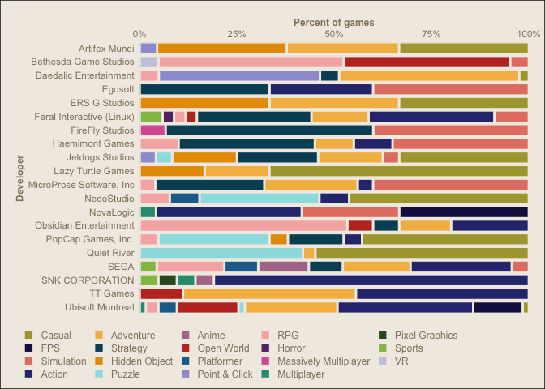
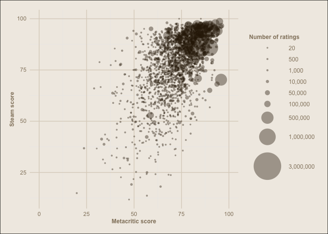

Mini Data Analysis Milestone 2
================

*To complete this milestone, you can either edit [this `.rmd`
file](https://raw.githubusercontent.com/UBC-STAT/stat545.stat.ubc.ca/master/content/mini-project/mini-project-2.Rmd)
directly. Fill in the sections that are commented out with
`<!--- start your work here--->`. When you are done, make sure to knit
to an `.md` file by changing the output in the YAML header to
`github_document`, before submitting a tagged release on canvas.*

# Welcome to the rest of your mini data analysis project!

In Milestone 1, you explored your data. and came up with research
questions. This time, we will finish up our mini data analysis and
obtain results for your data by:

- Making summary tables and graphs
- Manipulating special data types in R: factors and/or dates and times.
- Fitting a model object to your data, and extract a result.
- Reading and writing data as separate files.

We will also explore more in depth the concept of *tidy data.*

**NOTE**: The main purpose of the mini data analysis is to integrate
what you learn in class in an analysis. Although each milestone provides
a framework for you to conduct your analysis, it’s possible that you
might find the instructions too rigid for your data set. If this is the
case, you may deviate from the instructions – just make sure you’re
demonstrating a wide range of tools and techniques taught in this class.

# Instructions

**To complete this milestone**, edit [this very `.Rmd`
file](https://raw.githubusercontent.com/UBC-STAT/stat545.stat.ubc.ca/master/content/mini-project/mini-project-2.Rmd)
directly. Fill in the sections that are tagged with
`<!--- start your work here--->`.

**To submit this milestone**, make sure to knit this `.Rmd` file to an
`.md` file by changing the YAML output settings from
`output: html_document` to `output: github_document`. Commit and push
all of your work to your mini-analysis GitHub repository, and tag a
release on GitHub. Then, submit a link to your tagged release on canvas.

**Points**: This milestone is worth 50 points: 45 for your analysis, and
5 for overall reproducibility, cleanliness, and coherence of the Github
submission.

**Research Questions**: In Milestone 1, you chose two research questions
to focus on. Wherever realistic, your work in this milestone should
relate to these research questions whenever we ask for justification
behind your work. In the case that some tasks in this milestone don’t
align well with one of your research questions, feel free to discuss
your results in the context of a different research question.

# Learning Objectives

By the end of this milestone, you should:

- Understand what *tidy* data is, and how to create it using `tidyr`.
- Generate a reproducible and clear report using R Markdown.
- Manipulating special data types in R: factors and/or dates and times.
- Fitting a model object to your data, and extract a result.
- Reading and writing data as separate files.

# Setup

Begin by loading your data and the tidyverse package below:

``` r
library(tidyverse)
```

    ## ── Attaching core tidyverse packages ──────────────────────── tidyverse 2.0.0 ──
    ## ✔ dplyr     1.1.3     ✔ readr     2.1.4
    ## ✔ forcats   1.0.0     ✔ stringr   1.5.0
    ## ✔ ggplot2   3.4.3     ✔ tibble    3.2.1
    ## ✔ lubridate 1.9.2     ✔ tidyr     1.3.0
    ## ✔ purrr     1.0.2     
    ## ── Conflicts ────────────────────────────────────────── tidyverse_conflicts() ──
    ## ✖ dplyr::filter() masks stats::filter()
    ## ✖ dplyr::lag()    masks stats::lag()
    ## ℹ Use the conflicted package (<http://conflicted.r-lib.org/>) to force all conflicts to become errors

## Dataset creation

After working on the mini data analysis milestone 1 and reading the
requirements for milestone 2, I decided to change the dataset I was
working on to better adjust to the tasks and exercises in the project. I
stuck to the same theme (Steam Games) however I looked for datasets with
different variables (especially numeric ones that can be used for model
fitting) to build a new dataset. I landed on the [Steam Store
Games](https://www.kaggle.com/datasets/nikdavis/steam-store-games)
dataset from Nik Davis on Kaggle (renamed to `steam-kaggle.csv`), and
[Steam Game Data](https://data.world/craigkelly/steam-game-data) (the
`game-features.csv` set) from Craig Kelly on data.world. The procedure
for creating the dataset is shown below:

``` r
# import both files
steam_1_raw <- read_delim("data/steam-kaggle.csv", ",")
```

    ## Rows: 27075 Columns: 18
    ## ── Column specification ────────────────────────────────────────────────────────
    ## Delimiter: ","
    ## chr  (8): name, developer, publisher, platforms, categories, genres, steamsp...
    ## dbl  (9): appid, english, required_age, achievements, positive_ratings, nega...
    ## date (1): release_date
    ## 
    ## ℹ Use `spec()` to retrieve the full column specification for this data.
    ## ℹ Specify the column types or set `show_col_types = FALSE` to quiet this message.

``` r
steam_2_raw <- read_delim("data/games-features.csv", ",")
```

    ## Rows: 13357 Columns: 78
    ## ── Column specification ────────────────────────────────────────────────────────
    ## Delimiter: ","
    ## chr (23): QueryName, ResponseName, ReleaseDate, PriceCurrency, SupportEmail,...
    ## dbl (20): QueryID, ResponseID, RequiredAge, DemoCount, DeveloperCount, DLCCo...
    ## lgl (35): ControllerSupport, IsFree, FreeVerAvail, PurchaseAvail, Subscripti...
    ## 
    ## ℹ Use `spec()` to retrieve the full column specification for this data.
    ## ℹ Specify the column types or set `show_col_types = FALSE` to quiet this message.

``` r
# remove some columns like owners (which we will replace with the game-features set one) and others
steam_1 <- steam_1_raw %>%
  select(-c(owners, required_age, english))

# select columns of interest from steam_2_raw and rename them to match snake case
steam_2 <- steam_2_raw %>%
  select(QueryID, Metacritic, SteamSpyOwners, SteamSpyOwnersVariance) %>%
  rename(appid = QueryID,
         metacritic = Metacritic,
         owners = SteamSpyOwners,
         owners_variance = SteamSpyOwnersVariance)

# create final dataset
steam <- steam_1 %>%
  left_join(steam_2, by = "appid") %>%
  distinct()

head(steam)
```

    ## # A tibble: 6 × 18
    ##   appid name        release_date developer publisher platforms categories genres
    ##   <dbl> <chr>       <date>       <chr>     <chr>     <chr>     <chr>      <chr> 
    ## 1    10 Counter-St… 2000-11-01   Valve     Valve     windows;… Multi-pla… Action
    ## 2    20 Team Fortr… 1999-04-01   Valve     Valve     windows;… Multi-pla… Action
    ## 3    30 Day of Def… 2003-05-01   Valve     Valve     windows;… Multi-pla… Action
    ## 4    40 Deathmatch… 2001-06-01   Valve     Valve     windows;… Multi-pla… Action
    ## 5    50 Half-Life:… 1999-11-01   Gearbox … Valve     windows;… Single-pl… Action
    ## 6    60 Ricochet    2000-11-01   Valve     Valve     windows;… Multi-pla… Action
    ## # ℹ 10 more variables: steamspy_tags <chr>, achievements <dbl>,
    ## #   positive_ratings <dbl>, negative_ratings <dbl>, average_playtime <dbl>,
    ## #   median_playtime <dbl>, price <dbl>, metacritic <dbl>, owners <dbl>,
    ## #   owners_variance <dbl>

``` r
# exporting the dataset file
write_csv(steam, "data/steam.csv")
```

# Task 1: Process and summarize your data

From milestone 1, you should have an idea of the basic structure of your
dataset (e.g. number of rows and columns, class types, etc.). Here, we
will start investigating your data more in-depth using various data
manipulation functions.

### 1.1 (1 point)

First, write out the 4 research questions:

<!-------------------------- Start your work below ---------------------------->

1.  how has genre popularity changed across time?
2.  do developers tend to stick to the same types of games?
3.  how does metacritic score relate to player ratings?
4.  what is the relationship between the price of a game and its
    quality/reviews?
    <!----------------------------------------------------------------------------->

I changed my research questions stated on milestone 1 to better fit the
tasks for this milestone.

Here, we will investigate your data using various data manipulation and
graphing functions.

### 1.2 (8 points)

Now, for each of your four research questions, choose one task from
options 1-4 (summarizing), and one other task from 4-8 (graphing). You
should have 2 tasks done for each research question (8 total). Make sure
it makes sense to do them! (e.g. don’t use a numerical variables for a
task that needs a categorical variable.). Comment on why each task helps
(or doesn’t!) answer the corresponding research question.

Ensure that the output of each operation is printed!

Also make sure that you’re using dplyr and ggplot2 rather than base R.
Outside of this project, you may find that you prefer using base R
functions for certain tasks, and that’s just fine! But part of this
project is for you to practice the tools we learned in class, which is
dplyr and ggplot2.

**Summarizing:**

1.  Compute the *range*, *mean*, and *two other summary statistics* of
    **one numerical variable** across the groups of **one categorical
    variable** from your data.
2.  Compute the number of observations for at least one of your
    categorical variables. Do not use the function `table()`!
3.  Create a categorical variable with 3 or more groups from an existing
    numerical variable. You can use this new variable in the other
    tasks! *An example: age in years into “child, teen, adult, senior”.*
4.  Compute the proportion and counts in each category of one
    categorical variable across the groups of another categorical
    variable from your data. Do not use the function `table()`!

**Graphing:**

6.  Create a graph of your choosing, make one of the axes logarithmic,
    and format the axes labels so that they are “pretty” or easier to
    read.
7.  Make a graph where it makes sense to customize the alpha
    transparency.

Using variables and/or tables you made in one of the “Summarizing”
tasks:

8.  Create a graph that has at least two geom layers.
9.  Create 3 histograms, with each histogram having different sized
    bins. Pick the “best” one and explain why it is the best.

Make sure it’s clear what research question you are doing each operation
for!

<!------------------------- Start your work below ----------------------------->

#### RQ1 - How has genre popularity changed across time?

##### Summarising

*(2) Compute the number of observations for at least one of your
categorical variables.*

To determine the popularity of each genre or tags across time we first
need to determine the number of observations of each variable (number of
games). For this task I will determine the number of observations of the
following variables: - `genres` - `steamspy_tags` - `release_year` (not
exactly categorical but relevant to the research question).

For that I will have to split up the `genres` and the `steamspy_tags`
for each game entry, as some of them have different genres/tags assigned
to them (see chunk below). I will also need to create a new column
called `release_year` from `release_date`.

``` r
unique(steam$genres)[1:10]
```

    ##  [1] "Action"                               
    ##  [2] "Action;Free to Play"                  
    ##  [3] "Action;Free to Play;Strategy"         
    ##  [4] "Action;Adventure"                     
    ##  [5] "Indie"                                
    ##  [6] "Indie;Strategy"                       
    ##  [7] "Strategy"                             
    ##  [8] "RPG"                                  
    ##  [9] "Animation & Modeling;Video Production"
    ## [10] "Action;RPG"

``` r
unique(steam$steamspy_tags)[1:10]
```

    ##  [1] "Action;FPS;Multiplayer"           "FPS;World War II;Multiplayer"    
    ##  [3] "FPS;Action;Sci-fi"                "FPS;Classic;Action"              
    ##  [5] "FPS;Action;Singleplayer"          "Puzzle;First-Person;Singleplayer"
    ##  [7] "Free to Play;Multiplayer;FPS"     "Zombies;Co-op;FPS"               
    ##  [9] "Free to Play;MOBA;Strategy"       "Puzzle;Co-op;First-Person"

To separate the columns I will use the `separate_rows()` function from
`tidyr` with a `;` character as delimiter.

``` r
steam_rq1 <- steam %>%
  separate_rows(genres, sep = ";") %>%
  separate_rows(steamspy_tags, sep = ";")

unique(steam_rq1$genres)
```

    ##  [1] "Action"                "Free to Play"          "Strategy"             
    ##  [4] "Adventure"             "Indie"                 "RPG"                  
    ##  [7] "Animation & Modeling"  "Video Production"      "Casual"               
    ## [10] "Simulation"            "Racing"                "Violent"              
    ## [13] "Massively Multiplayer" "Nudity"                "Sports"               
    ## [16] "Early Access"          "Gore"                  "Utilities"            
    ## [19] "Design & Illustration" "Web Publishing"        "Education"            
    ## [22] "Software Training"     "Sexual Content"        "Audio Production"     
    ## [25] "Game Development"      "Photo Editing"         "Accounting"           
    ## [28] "Documentary"           "Tutorial"

``` r
unique(steam_rq1$steamspy_tags)[1:20]
```

    ##  [1] "Action"       "FPS"          "Multiplayer"  "World War II" "Sci-fi"      
    ##  [6] "Classic"      "Singleplayer" "Puzzle"       "First-Person" "Free to Play"
    ## [11] "Zombies"      "Co-op"        "MOBA"         "Strategy"     "Shooter"     
    ## [16] "Indie"        "Fighting"     "Cyberpunk"    "RTS"          "Hacking"

For the `release_year` column I will use the `year()` function from the
`lubridate` package.

``` r
library(lubridate)
```

``` r
steam_rq1 <- steam_rq1 %>%
  mutate(release_year = year(release_date)) 

steam_rq1 %>% 
  #separating the genres and tags created repeated columns per game release, so to get the number of releases per year we need to remove the duplicated columns
  select(appid, release_year) %>%
  distinct() %>% 
  count(release_year)
```

    ## # A tibble: 23 × 2
    ##    release_year     n
    ##           <dbl> <int>
    ##  1         1997     1
    ##  2         1998     1
    ##  3         1999     2
    ##  4         2000     2
    ##  5         2001     4
    ##  6         2002     1
    ##  7         2003     3
    ##  8         2004     6
    ##  9         2005     6
    ## 10         2006    48
    ## # ℹ 13 more rows

Now to get the number of occurrences for the other two categorical
variables:

``` r
steam_rq1 %>%
  count(genres, sort = TRUE) 
```

    ## # A tibble: 29 × 2
    ##    genres           n
    ##    <chr>        <int>
    ##  1 Indie        56824
    ##  2 Action       35066
    ##  3 Adventure    29751
    ##  4 Casual       29618
    ##  5 Strategy     15388
    ##  6 Simulation   15246
    ##  7 RPG          12818
    ##  8 Early Access  8807
    ##  9 Free to Play  5089
    ## 10 Sports        3884
    ## # ℹ 19 more rows

``` r
steam_rq1 %>%
  count(steamspy_tags, sort = TRUE)
```

    ## # A tibble: 339 × 2
    ##    steamspy_tags     n
    ##    <chr>         <int>
    ##  1 Indie         47254
    ##  2 Action        32112
    ##  3 Casual        24107
    ##  4 Adventure     23789
    ##  5 Strategy      12771
    ##  6 Early Access  12355
    ##  7 Simulation     9800
    ##  8 RPG            8902
    ##  9 Free to Play   6184
    ## 10 Racing         2436
    ## # ℹ 329 more rows

The data that helps answer the research question is also obtained the
same way:

``` r
steam_rq1 %>%
  select(appid, release_year, genres) %>%
  distinct() %>%
  count(release_year,genres)
```

    ## # A tibble: 280 × 3
    ##    release_year genres       n
    ##           <dbl> <chr>    <int>
    ##  1         1997 Action       1
    ##  2         1997 Indie        1
    ##  3         1997 Racing       1
    ##  4         1998 Action       1
    ##  5         1999 Action       2
    ##  6         2000 Action       2
    ##  7         2001 Action       3
    ##  8         2001 Indie        1
    ##  9         2001 RPG          2
    ## 10         2001 Strategy     1
    ## # ℹ 270 more rows

``` r
steam_rq1 %>%
  select(appid, release_year, steamspy_tags) %>%
  distinct() %>%
  count(release_year, steamspy_tags)
```

    ## # A tibble: 2,267 × 3
    ##    release_year steamspy_tags     n
    ##           <dbl> <chr>         <int>
    ##  1         1997 Action            1
    ##  2         1997 Classic           1
    ##  3         1997 Racing            1
    ##  4         1998 Action            1
    ##  5         1998 Classic           1
    ##  6         1998 FPS               1
    ##  7         1999 Action            2
    ##  8         1999 FPS               2
    ##  9         1999 Multiplayer       1
    ## 10         1999 Sci-fi            1
    ## # ℹ 2,257 more rows

##### Graphing

*(8) Create a graph that has at least two geom layers*

I will be graphing the top 11 genres and top 16 tags for better
visualization. Why such an arbitrary numbers? Because I noticed that the
earliest genres (1997) had only 3 genres: `Action`, `Indie` and
`Racing`. The first two are abundant enough throughout the dataset,
however `Racing` is in the 11th place when ordered by number of
observations, and I want to keep it to better represent those early
games. For that I will create a vector to filter with.

``` r
top_genres <- steam_rq1 %>%
  select(appid, genres) %>%
  distinct() %>%
  count(genres, sort = TRUE) %>%
  slice_head(n = 11) %>%
  pull(genres)

top_tags <- steam_rq1 %>%
  select(appid, steamspy_tags) %>%
  distinct() %>%
  count(steamspy_tags, sort = TRUE) %>%
  slice_head(n = 16) %>%
  pull(steamspy_tags)

print(top_genres)
```

    ##  [1] "Indie"        "Action"       "Casual"       "Adventure"    "Strategy"    
    ##  [6] "Simulation"   "RPG"          "Early Access" "Free to Play" "Sports"      
    ## [11] "Racing"

``` r
print(top_tags)
```

    ##  [1] "Indie"          "Action"         "Casual"         "Adventure"     
    ##  [5] "Strategy"       "Simulation"     "Early Access"   "RPG"           
    ##  [9] "Free to Play"   "Puzzle"         "VR"             "Sports"        
    ## [13] "Racing"         "Platformer"     "Nudity"         "Sexual Content"

I noticed that there are many `steamspy_tags` that are the same as
`genres` so I will filter for only unique tags that don’t duplicate
steam `genres`.

``` r
top_unique_tags <- steam_rq1 %>%
  filter(!steamspy_tags %in% genres) %>%
  select(appid, steamspy_tags) %>%
  distinct() %>%
  count(steamspy_tags, sort = TRUE) %>%
  slice_head(n = 16) %>%
  pull(steamspy_tags)

print(top_unique_tags)
```

    ##  [1] "Puzzle"         "VR"             "Platformer"     "Visual Novel"  
    ##  [5] "Anime"          "Horror"         "Point & Click"  "Hidden Object" 
    ##  [9] "FPS"            "Multiplayer"    "Pixel Graphics" "Shoot 'Em Up"  
    ## [13] "Open World"     "Survival"       "Space"          "Arcade"

For this task I want to create a stream chart using the `ggstream`
package for `ggplot`. To show how genre/tag popularity have evolved
throughout the years.

``` r
library(ggstream)
```

I also will set a custom color palette for better category distinction
(taken from two `MetBrewer` palettes):

``` r
pal= c("#17154FFF", "#2F357CFF", "#6C5D9EFF", "#9D9CD5FF", "#B0799AFF", "#F6B3B0FF", "#E48171FF", "#BF3729FF", "#E69B00FF", "#F5BB50FF", "#ADA43BFF", "#355828FF", "#92C051FF", "#2B9B81FF", "#1F6E9CFF","#633372FF", "#E6A2A6FF", "#E87B89FF")
```

Now on to the graphs:

``` r
steam_rq1 %>%
  # get observation counts and percentage of each genre for each year
  select(appid, release_year, genres) %>%
  distinct() %>%
  count(release_year, genres) %>%
  group_by(release_year) %>%
  mutate(percentage = 100*n/sum(n)) %>%
  
  # filter for top genres
  filter(genres %in% top_genres) %>%
  
  # create plot
  ggplot(aes(release_year, percentage, 
             fill = genres, 
             label = genres)) +
  
  # add lines for year marks
  geom_vline(data = tibble(x = c(1997, seq(1998,2018,2), 2019), 1), 
             aes(xintercept = x),
             linetype = "dashed",
             color = "#DCD3C5",
             linewidth = 0.3) +
  scale_x_continuous(position = "top", 
                     labels = c(1997, seq(1998,2018,2), 2019), 
                     breaks = c(1997, seq(1998,2018,2), 2019))+
  
  # streamgraph
  geom_stream(bw = 0.82, sorting = "onset") +
  
  # theme and visual stuff
  scale_fill_manual(values = pal) +
  theme_minimal() +
  theme(legend.position = "right",
        legend.title = element_blank(),
        axis.title.x = element_blank(),
        axis.title.y = element_blank(),
        axis.text.y = element_blank(),
        axis.text.x = element_text(size = 9, 
                                   color = "#93836C", 
                                   angle = 45),
        axis.text.x.top = element_text(margin = margin(b = 10)),
        panel.grid = element_blank(),
        legend.text = element_text(size = 9, color = "#1c1204"),
        legend.spacing.y = unit(5,"pt"),
        plot.margin = margin(rep(15, 4)),
        plot.background = element_rect(fill = "#F1ECE4", color = NA),
        panel.background = element_blank()) +
  guides(fill = guide_legend(byrow = TRUE)) # added this so legend items separate from each other
```

<!-- -->

``` r
steam_rq1 %>%
  # get observation counts and percentage of each tag for each year
  filter(steamspy_tags %in% top_unique_tags) %>%
  select(appid, release_year, steamspy_tags) %>%
  distinct() %>%
  count(release_year, steamspy_tags) %>%
  group_by(release_year) %>%
  mutate(percentage = 100*n/sum(n)) %>%
  
  # filter for top unique tags
  
  # create plot
  ggplot(aes(release_year, percentage, 
             fill = steamspy_tags, 
             label = steamspy_tags)) +
  
  # add lines for year marks
  geom_vline(data = tibble(x = c(seq(1998,2018,2), 2019), 1), 
             aes(xintercept = x),
             linetype = "dashed",
             color = "#DCD3C5",
             linewidth = 0.3) +
  scale_x_continuous(position = "top", 
                     labels = c(seq(1998,2018,2), 2019), 
                     breaks = c(seq(1998,2018,2), 2019)) +
  
  # streamgraph
  geom_stream(bw = 0.82, sorting = "onset") +
  
  # theme and visual stuff
  scale_fill_manual(values = pal) +
  theme_minimal() +
  theme(legend.position = "right",
        legend.title = element_blank(),
        axis.title.x = element_blank(),
        axis.title.y = element_blank(),
        axis.text.y = element_blank(),
        axis.text.x = element_text(size = 9, 
                                   color = "#93836C", 
                                   angle = 45),
        axis.text.x.top = element_text(margin = margin(b = 10)),
        panel.grid = element_blank(),
        legend.text = element_text(size = 9, color = "#1c1204"),
        legend.spacing.y = unit(2,"pt"),
        legend.key.size = unit(15, "pt"),
        plot.margin = margin(15,20,30,15),
        plot.background = element_rect(fill = "#F1ECE4", color = NA),
        panel.background = element_blank()) +
  guides(fill = guide_legend(byrow = TRUE))
```

<!-- -->

These graphs represent the proportion share of the top genres/tags from
games released each year. I’d say the second graph is more interesting
because there is a greater variety of tags than genres. It is expected
that some older tags/genres decrease in proportion as new types of games
emerge, but it is still interesting to see the evolution. There is also
a significant increase in proportion of indie games as more and more
game making tools become accessible to people. I used proportions
instead of actual counts because the amount of games released has
dramatically increased throughout the years, so we wouldn’t be able to
appreciate the genre/tags from earlier years. Here is an example:

``` r
steam_rq1 %>%
  filter(genres %in% top_genres) %>%
  select(appid, release_year, genres) %>%
  distinct() %>%
  count(release_year, genres) %>%
  ggplot(aes(release_year, n, 
             fill = genres, 
             label = genres)) +
  geom_vline(data = tibble(x = c(1997, seq(2000,2018,2), 2019), 1), 
             aes(xintercept = x),
             linetype = "dashed",
             color = "#DCD3C5",
             linewidth = 0.3) +
  scale_x_continuous(position = "top", 
                     labels = c(1997, seq(2000,2018,2), 2019), 
                     breaks = c(1997, seq(2000,2018,2), 2019))+
  geom_stream(bw = 0.7, sorting = "onset") +
  scale_fill_manual(values = pal) +
  theme_minimal() +
  theme(legend.position = "right",
        legend.title = element_blank(),
        axis.title.x = element_blank(),
        axis.title.y = element_blank(),
        axis.text.y = element_blank(),
        axis.text.x = element_text(size = 9, 
                                   color = "#93836C", 
                                   angle = 45),
        axis.text.x.top = element_text(margin = margin(b = 10)),
        panel.grid = element_blank(),
        legend.text = element_text(size = 9, color = "#1c1204"),
        legend.spacing.y = unit(5,"pt"),
        plot.margin = margin(rep(15, 4)),
        plot.background = element_rect(fill = "#F1ECE4", color = NA),
        panel.background = element_blank()) +
  guides(fill = guide_legend(byrow = TRUE)) 
```

<!-- -->

It’s impossible to see any genres from games released before 2008.

#### RQ2 - Do developers tend to stick to the same types of games?

##### Summarising

*(4) Compute the proportion and counts in each category of one
categorical variable across the groups of another categorical variable
from your data.*

To prep for this I need to do three things:

1.  Separate the entries that have multiple game developers.
2.  Filter out genres and tags such as `Early Access`, `Free to Play`,
    and `Indie` , because they don’t specify the **type** of game. For
    example, `Indie` will be applied to any small developer regardless
    of the type of game it is.
3.  Merge the `genres` and `steamspy_tags` columns so that I don’t have
    to do everything twice and we get a better picture on the type of
    games.

Separating the entries and filtering:

``` r
steam_rq2 <- steam_rq1 %>%
  separate_rows(developer, sep = ";") %>%
  filter(!genres %in% c("Early Access", "Indie", "Free to Play") & 
         !steamspy_tags %in% c("Early Access", "Indie", "Free to Play") & 
         !steamspy_tags %in% genres)

head(steam_rq2, 10)
```

    ## # A tibble: 10 × 19
    ##    appid name       release_date developer publisher platforms categories genres
    ##    <dbl> <chr>      <date>       <chr>     <chr>     <chr>     <chr>      <chr> 
    ##  1    10 Counter-S… 2000-11-01   Valve     Valve     windows;… Multi-pla… Action
    ##  2    10 Counter-S… 2000-11-01   Valve     Valve     windows;… Multi-pla… Action
    ##  3    20 Team Fort… 1999-04-01   Valve     Valve     windows;… Multi-pla… Action
    ##  4    20 Team Fort… 1999-04-01   Valve     Valve     windows;… Multi-pla… Action
    ##  5    30 Day of De… 2003-05-01   Valve     Valve     windows;… Multi-pla… Action
    ##  6    30 Day of De… 2003-05-01   Valve     Valve     windows;… Multi-pla… Action
    ##  7    30 Day of De… 2003-05-01   Valve     Valve     windows;… Multi-pla… Action
    ##  8    40 Deathmatc… 2001-06-01   Valve     Valve     windows;… Multi-pla… Action
    ##  9    40 Deathmatc… 2001-06-01   Valve     Valve     windows;… Multi-pla… Action
    ## 10    50 Half-Life… 1999-11-01   Gearbox … Valve     windows;… Single-pl… Action
    ## # ℹ 11 more variables: steamspy_tags <chr>, achievements <dbl>,
    ## #   positive_ratings <dbl>, negative_ratings <dbl>, average_playtime <dbl>,
    ## #   median_playtime <dbl>, price <dbl>, metacritic <dbl>, owners <dbl>,
    ## #   owners_variance <dbl>, release_year <dbl>

For merging `genres` and `steamspy_tags` into `game_type` I will use
`pivot_longer`:

``` r
(steam_rq2_longer <- steam_rq2 %>%
  pivot_longer(cols = c(genres, steamspy_tags),
               names_to = "category",
               values_to = "game_type") %>%
  select(developer, game_type, name, appid) %>%
  distinct()) #for removing duplicated rows
```

    ## # A tibble: 35,077 × 4
    ##    developer game_type    name                  appid
    ##    <chr>     <chr>        <chr>                 <dbl>
    ##  1 Valve     Action       Counter-Strike           10
    ##  2 Valve     FPS          Counter-Strike           10
    ##  3 Valve     Multiplayer  Counter-Strike           10
    ##  4 Valve     Action       Team Fortress Classic    20
    ##  5 Valve     FPS          Team Fortress Classic    20
    ##  6 Valve     Multiplayer  Team Fortress Classic    20
    ##  7 Valve     Action       Day of Defeat            30
    ##  8 Valve     FPS          Day of Defeat            30
    ##  9 Valve     World War II Day of Defeat            30
    ## 10 Valve     Multiplayer  Day of Defeat            30
    ## # ℹ 35,067 more rows

Now we can compute the proportion and count of game types per developer:

``` r
(steam_rq2_gametype_count <- steam_rq2_longer %>% 
  count(game_type, developer) %>% 
  group_by(developer) %>%
  reframe(developer, game_type, n, proportion = n/sum(n)))
```

    ## # A tibble: 26,048 × 4
    ##    developer          game_type       n proportion
    ##    <chr>              <chr>       <int>      <dbl>
    ##  1 +Mpact Games, LLC. Action          1     0.333 
    ##  2 +Mpact Games, LLC. Multiplayer     1     0.333 
    ##  3 +Mpact Games, LLC. Swordplay       1     0.333 
    ##  4 .M.Y.W.            Puzzle          1     0.5   
    ##  5 .M.Y.W.            Strategy        1     0.5   
    ##  6 .dat               RPG             1     0.2   
    ##  7 .dat               Strategy        2     0.4   
    ##  8 .dat               Turn-Based      2     0.4   
    ##  9 07th Expansion     2D Fighter      1     0.0357
    ## 10 07th Expansion     Action          1     0.0357
    ## # ℹ 26,038 more rows

##### Graphing

*(6) Create a graph of your choosing, make one of the axes logarithmic,
and format the axes labels so that they are “pretty” or easier to read.*

``` r
library(scales)
```

    ## 
    ## Attaching package: 'scales'

    ## The following object is masked from 'package:purrr':
    ## 
    ##     discard

    ## The following object is masked from 'package:readr':
    ## 
    ##     col_factor

I would like to make a stacked barplot to help answer my research
question, with the developers on the x-axis and the “relative abundance”
of `game_type` in the y-axis, with colors to distinguish between
`game_type`. However I’m thinking that I will probably need to select a
number of developers to display, if not the graph will be too dense to
make sense of.

First lets figure out how many developers we are working with (*note
that this is different from the real number of developers in the steam
dataset because we have filtered out some genres and tags for this
task*):

``` r
length(unique(steam_rq2_longer$developer))
```

    ## [1] 7656

That’s way too many developers for the plot. I want to see the
distribution of games per developer, to better understand what I’m
working with and if I should set a cut-off point based on the number of
games.

``` r
(steam_rq2_gamecount <- steam_rq2_longer %>%
  select(developer, appid) %>%
  group_by(developer) %>%
  distinct() %>%
  reframe(n = n()) %>%
  arrange(desc(n)))
```

    ## # A tibble: 7,656 × 2
    ##    developer                      n
    ##    <chr>                      <int>
    ##  1 Feral Interactive (Mac)       41
    ##  2 KOEI TECMO GAMES CO., LTD.    41
    ##  3 Blender Games                 40
    ##  4 Humongous Entertainment       36
    ##  5 Laush Dmitriy Sergeevich      35
    ##  6 Eipix Entertainment           33
    ##  7 Square Enix                   31
    ##  8 HeR Interactive               29
    ##  9 ERS G Studios                 28
    ## 10 Arc System Works              25
    ## # ℹ 7,646 more rows

``` r
steam_rq2_gamecount %>%
  ggplot(aes(n)) +
  geom_histogram(binwidth = 1, fill = "#93836C") +
  scale_x_continuous(breaks = c(1,seq(2,41,2))) +
  scale_y_continuous(trans = scales::log1p_trans(),
                     breaks = c(1, 2, 5, 10, 50, 100, 250, 500, 1000, 2500, 5000),
                     expand = c(0,0)) +
  xlab("Games per developer") +
  ylab("Number of developers") +
  
  #theme
  theme_minimal() +
  theme(title = element_text(size = 9, face = "bold", color = "#93836C"),
        axis.text.y = element_text(size = 9, color = "#93836C"),
        axis.text.x = element_text(size = 9, color = "#93836C"),
        axis.ticks.x = element_line(color = "#DCD3C5"),
        axis.ticks.length.x = unit(10, "pt"),
        panel.grid.major.y = element_line(color = "#DCD3C5"),
        panel.grid.minor = element_blank(),
        panel.grid.major.x = element_blank(),
        panel.grid.minor.x = element_blank(),
        plot.margin = margin(rep(15, 4)),
        plot.background = element_rect(fill = "#F1ECE4", color = NA),
        panel.background = element_blank())
```

<!-- -->

*Note: The following graph corresponds to the chosen graphing task,
however it’s not the graph I want to conclude this section with.*

As we can see, most of the developers have only released 1 game, which
won’t do for visualizing the diversity of game types across developers.
We can try to cut off at say 8 games, and see how many developers are
left:

``` r
steam_rq2_gamecount %>%
  filter(n >= 8) %>%
  pull(developer) %>%
  length()
```

    ## [1] 131

`131` is still too many, but I’m thinking of a fun solution, we could
pick 20 random developers from those 131 (using `slice_sample`) and plot
them. Why this instead of picking the top 20 developers with most games?
Because I don’t want to be biased towards big established developers :).

``` r
# note that this will choose different developers each time it is run
(random_devs <- steam_rq2_gamecount %>%
  filter(n>= 8) %>%
  slice_sample(n = 20) %>%
  pull(developer))
```

    ##  [1] "Egosoft"                   "Jetdogs Studios"          
    ##  [3] "TT Games"                  "SNK CORPORATION"          
    ##  [5] "NovaLogic"                 "Quiet River"              
    ##  [7] "PopCap Games, Inc."        "Lazy Turtle Games"        
    ##  [9] "Daedalic Entertainment"    "NedoStudio"               
    ## [11] "Bethesda Game Studios"     "Haemimont Games"          
    ## [13] "MicroProse Software, Inc"  "Ubisoft Montreal"         
    ## [15] "Feral Interactive (Linux)" "SEGA"                     
    ## [17] "ERS G Studios"             "Artifex Mundi"            
    ## [19] "FireFly Studios"           "Obsidian Entertainment"

Now what I will need is to select the top 20 game types:

``` r
(top_gametypes <- steam_rq2_longer %>% 
  count(game_type, sort = TRUE) %>%
  slice_head(n = 20) %>%
  pull(game_type))
```

    ##  [1] "Action"                "Adventure"             "Casual"               
    ##  [4] "Strategy"              "Simulation"            "RPG"                  
    ##  [7] "Puzzle"                "VR"                    "Anime"                
    ## [10] "Platformer"            "Visual Novel"          "Point & Click"        
    ## [13] "Hidden Object"         "Horror"                "Multiplayer"          
    ## [16] "FPS"                   "Sports"                "Open World"           
    ## [19] "Massively Multiplayer" "Pixel Graphics"

And load `forcats` and create the color palette for the graph.

``` r
library(forcats) #to work with factors and rearrange them
```

``` r
# color palette
pal2 <- c("#17154FFF", "#2F357CFF", "#6C5D9EFF", "#9D9CD5FF", "#B0799AFF", "#F6B3B0FF", "#E48171FF", "#BF3729FF", "#E69B00FF", "#F5BB50FF", "#ADA43BFF", "#355828FF", "#92C051FF", "#2B9B81FF", "#014E65", "#1F6E9CFF", "#9BDFE2", "#CACAE0", "#633372FF", "#D960A2")
```

Now the final graph:

``` r
steam_rq2_gametype_count %>%
  filter(developer %in% random_devs & 
         game_type %in% top_gametypes) %>%
  
  # plot
  ggplot(aes(x = fct_rev(developer), 
             y = n, 
             fill = fct_reorder(game_type, n, .desc = TRUE))) +
  geom_col(position = "fill", color = "#F1ECE4", linewidth = 1) +
  scale_y_continuous(labels = scales::percent_format(),
                     position = "right",
                     expand = c(0,0)
                     ) +
  scale_x_discrete(expand = c(0,0)) +
  ylab("Percent of games") +
  xlab("Developer") +
  
  # random colors! will change everytime it is run
  scale_fill_manual(values = sample(pal2)) + 
  
  # theme
  theme_minimal() +
  theme(title = element_text(size = 9, face = "bold", color = "#93836C"),
        legend.position = c(0.25,-0.15),
        legend.direction = "horizontal",
        legend.title = element_blank(),
        legend.text = element_text(size = 9, color = "#93836C"),
        legend.key.size = unit(12, "pt"),
        axis.text.x = element_text(color = "#93836C", hjust = 0.5),
        axis.text.y = element_text(color = "#93836C", vjust = 0.4),
        plot.background = element_rect(fill = "#F1ECE4"),
        panel.background = element_blank(),
        plot.margin = margin(15, 15, 70, 15)) +
  
  # flipping coordinates because developer names are long
  coord_flip() 
```

<!-- -->

It’s very interesting to visualize the diversity of each developer. We
can see that some developers release a wide variety of games while
others tend to stick to the same types of games. Calculating a sort of
diversity index would be interesting to numerically answer my research
question, but that is out of my scope for this milestone. Still, this
graph is very pretty ☺️.

#### RQ3 - How does metacritic score relate to player ratings?

##### Summarising

*(3) Create a categorical variable with 3 or more groups from an
existing numerical variable.*

Steam’s has two types of reviews: positive and negative. The percentage
of the positive reviews and the number of reviews determines the final
game review category. Steam hasn’t disclosed the exact numbers so I will
base off of the following table (based on u/runevision’s [post on the
r/Steam
subreddit](https://www.reddit.com/r/Steam/comments/ivz45n/what_does_the_steam_ratings_like_very_negative_or/?utm_source=share&utm_medium=web3x&utm_name=web3xcss&utm_term=1&utm_content=share_button):

| % positive | number of reviews | review                  |
|------------|-------------------|-------------------------|
| 95-100     | 500+              | Overwhelmingly Positive |
| 80-100     | 50-499            | Very Positive           |
| 80-94      | 500+              | Very Positive           |
| 80-100     | 10-49             | Positive                |
| 70-79      | 10+               | Mostly Positive         |
| 40-60      | 10+               | Mixed                   |
| 20-39      | 10+               | Mostly Negative         |
| 0-19       | 10-49             | Negative                |
| 0-19       | 50-499            | Very Negative           |
| 0-19       | 500+              | Overwhelmingly Negative |

So I will create a new categorical variable `review` from the
`positive_ratings` and `negative_ratings` variables. For that I will
need to compute: `number_ratings` and `score` (percent of positive
ratings).

``` r
# setting up the review labels in order from best to worst
(review_labels <- c("Overwhelmingly Positive","Very Positive","Positive", "Mostly Positive", "Mixed", "Mostly Negative", "Negative", "Very Negative", "Overwhelmingly Negative"))
```

    ## [1] "Overwhelmingly Positive" "Very Positive"          
    ## [3] "Positive"                "Mostly Positive"        
    ## [5] "Mixed"                   "Mostly Negative"        
    ## [7] "Negative"                "Very Negative"          
    ## [9] "Overwhelmingly Negative"

To create the `review` column I will make use of the `mutate` function
along with the `case_when` to specify which cases correspond to each
type of review.

``` r
steam_rq3 <- steam %>%
  mutate(number_ratings = positive_ratings + negative_ratings,
         score = 100 * positive_ratings / number_ratings,
         review = case_when(
           score >= 95 & number_ratings >= 500 ~ "Overwhelmingly Positive",
           score >= 80 & number_ratings >= 500 ~ "Very Positive",
           score >= 80 & number_ratings >= 50 ~  "Very Positive",
           score >= 80 & number_ratings >= 10 ~  "Positive",
           score >= 70 & number_ratings >= 10 ~ "Mostly Positive",
           score >= 40 & number_ratings >= 10 ~ "Mixed",
           score >= 20 & number_ratings >= 10 ~ "Mostly Negative",
           score >= 0 & number_ratings >= 500 ~ "Overwhelmingly Negative",
           score >= 0 & number_ratings >= 50 ~ "Very Negative",
           score >= 10 & number_ratings >= 10 ~ "Negative",
         )) %>%
  filter(!is.na(review)) # removes games without review

steam_rq3 %>%
  select(name, number_ratings, score, review) %>%
  head(10)
```

    ## # A tibble: 10 × 4
    ##    name                           number_ratings score review                 
    ##    <chr>                                   <dbl> <dbl> <chr>                  
    ##  1 Counter-Strike                         127873  97.4 Overwhelmingly Positive
    ##  2 Team Fortress Classic                    3951  84.0 Very Positive          
    ##  3 Day of Defeat                            3814  89.6 Very Positive          
    ##  4 Deathmatch Classic                       1540  82.7 Very Positive          
    ##  5 Half-Life: Opposing Force                5538  94.8 Very Positive          
    ##  6 Ricochet                                 3442  80.1 Very Positive          
    ##  7 Half-Life                               28855  96.2 Overwhelmingly Positive
    ##  8 Counter-Strike: Condition Zero          13559  89.4 Very Positive          
    ##  9 Half-Life: Blue Shift                    4242  90.1 Very Positive          
    ## 10 Half-Life 2                             70321  96.6 Overwhelmingly Positive

##### Graphing

*(7) Make a graph where it makes sense to customize the alpha
transparency.*

Now, returning to the research question: *how does metacritic score
relate to player ratings?*, I want to visualize this relationship with a
scatter plot, with `metacritic` score on the x-axis and player rating
(`score`) on the y-axis.

``` r
steam_rq3 %>%
  # removing entries without metacritic score
  filter(metacritic > 0) %>%
  
  # plot
  ggplot(aes(metacritic, score)) +
  geom_jitter(aes(size = number_ratings),  # geom_jitter to create a better looking plot
              stroke = 0, 
              color = "#301f07",
              alpha = 0.4) +
  scale_size(breaks = c(20, 500, 1000, 10000, 50000, 100000, 500000, 1000000, 3000000),
             range = c(1.2, 20), 
             labels = scales::label_comma(),
             name="Number of ratings") +
  scale_x_continuous(limits = c(0,100)) +
  ylab("Steam score") +
  xlab("Metacritic score") +
  
  # theme
  theme_minimal() +
  theme(title = element_text(size = 9, face = "bold", color = "#93836C"),
        legend.text = element_text(size = 9, color = "#93836C"),
        axis.text.x = element_text(color = "#93836C", hjust = 0.5),
        axis.text.y = element_text(color = "#93836C", vjust = 0.4),
        panel.grid.major = element_line(color = "#DCD3C5"),
        plot.background = element_rect(fill = "#F1ECE4"),
        panel.background = element_blank(),
        plot.margin = margin(rep(15,4)))
```

<!-- -->

We can see there is a general positive correlation between Steam score
and Metacritic score, however there are some exceptions where some games
have a high Metacritic score but low Steam score and vice versa. Most
games with high Metacritic score and high Steam score also have the most
number of ratings (popular games!).

#### RQ4 - What is the relationship between the price of a game and its quality/reviews?

##### Summarising

*(1) Compute the range, mean, and two other summary statistics of one
numerical variable across the groups of one categorical variable from
your data.*

The numerical value I will be looking at is `price` and the categorical
variable will be `review` which we created in the last question.

``` r
steam_rq3_summary <- steam_rq3 %>%
  group_by(fct_relevel(review, review_labels)) %>% #for ordering the results
  reframe(price_min = min(price),
          price_max = max(price),
          price_mean = mean(price),
          price_stdev = sd(price),
          price_median = median(price),
          ) %>%
  rename(review = 'fct_relevel(review, review_labels)')

steam_rq3_summary
```

    ## # A tibble: 9 × 6
    ##   review                 price_min price_max price_mean price_stdev price_median
    ##   <fct>                      <dbl>     <dbl>      <dbl>       <dbl>        <dbl>
    ## 1 Overwhelmingly Positi…      0         45.0       9.50        7.22         7.99
    ## 2 Very Positive               0         96.0       8.31        8.07         6.99
    ## 3 Positive                    0        210.        5.40        7.06         3.99
    ## 4 Mostly Positive             0        155.        7.11        8.29         4.99
    ## 5 Mixed                       0        155.        5.67        7.36         3.99
    ## 6 Mostly Negative             0         50.0       4.74        5.93         2.89
    ## 7 Negative                    0         46.5       5.14        6.54         3.99
    ## 8 Very Negative               0.79      15.0       6.57        4.44         5.69
    ## 9 Overwhelmingly Negati…      0.79      11.0       6.68        3.46         6.99

It’s interesting to see how there are no free games with Very Negative
or Overwhelmingly Negative reviews. This could be attributed to the fact
that most players will probably not expect much from free games and
won’t be upset if it turns out to be a bad game. However if the game
costs money and it sucks then more reason to give a negative review.
Overwhelmingly positive games have the highest mean and median prices,
but if the difference is significant between the `review` categories
would require statistical testing.

##### Graphing

*(6) Create a graph of your choosing, make one of the axes logarithmic,
and format the axes labels so that they are “pretty” or easier to read.*

For the graphing I want to compare both the metacritic score and the
review category against the price, to see if there is any trend or
relation.

Here is the palette I will use:

``` r
pal3 <- c("#004B59", "#017692", "#2bd4cb", "#a7d5b2", "#92a5df", "#EBA3EA", "#F85F6F", "#ff7536", "#e7106c")
```

Now I need to create the tibble for the graph:

``` r
steam_rq4 <- steam_rq3 %>%
  mutate(review = fct_relevel(review, review_labels),
         # review 2 will be used for the group aesthetic for the first geom
         review2 = review) %>% 
  filter(metacritic > 0) %>% # drop entries that don't have metacritic score
  select(appid, name,price, metacritic, score, review, review2, number_ratings)

head(steam_rq4, 10)
```

    ## # A tibble: 10 × 8
    ##    appid name               price metacritic score review review2 number_ratings
    ##    <dbl> <chr>              <dbl>      <dbl> <dbl> <fct>  <fct>            <dbl>
    ##  1    10 Counter-Strike      7.19         88  97.4 Overw… Overwh…         127873
    ##  2    30 Day of Defeat       3.99         79  89.6 Very … Very P…           3814
    ##  3    70 Half-Life           7.19         96  96.2 Overw… Overwh…          28855
    ##  4    80 Counter-Strike: C…  7.19         65  89.4 Very … Very P…          13559
    ##  5   130 Half-Life: Blue S…  3.99         71  90.1 Very … Very P…           4242
    ##  6   220 Half-Life 2         7.19         96  96.6 Overw… Overwh…          70321
    ##  7   240 Counter-Strike: S…  7.19         88  95.6 Overw… Overwh…          80137
    ##  8   300 Day of Defeat: So…  7.19         80  89.7 Very … Very P…          11699
    ##  9   380 Half-Life 2: Epis…  5.79         87  93.9 Very … Very P…           8425
    ## 10   400 Portal              7.19         90  98.0 Overw… Overwh…          52881

Now to create the graph:

``` r
steam_rq4 %>%
  ggplot(aes(x = price, y = metacritic)) +
  
  # first geom, background
  geom_jitter(data = steam_rq4 %>% select(-review), 
              aes(group = review2, size = number_ratings), 
              color="#DCD3C5", 
              width = 0.1, 
              alpha=0.5) +
  
  # second geom, colored highlight for each category
  geom_jitter(aes(color = review, size = number_ratings), 
              width = 0.05) +
  
  # axis settings
  scale_size(breaks = c(20, 1000, 10000, 100000, 1000000),
             range = c(0.4, 8), 
             labels = scales::label_comma(),
             name= "Number of ratings") +
  scale_x_continuous(trans = scales::log1p_trans(),
                     breaks = c(0,1.5,5,20,60),
                     labels = scales::dollar_format()) +
  xlab("Price (USD)") +
  ylab("Metacritic score") +
  
  # theme and color
  scale_color_manual(values = pal3) +
  theme_minimal() +
  guides(color = "none",
         size = guide_legend(override.aes = list(color ="#93836C"))
         ) +
  theme(title = element_text(size = 9, face = "bold", color = "#93836C"),
        strip.text = element_text(size = 8, color = "#93836C"),
        legend.text = element_text(size = 9, color = "#93836C"),
        legend.position = "bottom",
        axis.text.x = element_text(size = 8, color = "#93836C", angle = 45, hjust = 1),
        axis.text.y = element_text(size = 8, color = "#93836C"),
        panel.grid.major = element_line(color = "#DCD3C5", linewidth = 0.3),
        plot.background = element_rect(fill = "#F1ECE4"),
        panel.background = element_blank(),
        plot.margin = margin(15,30,15,15)
        ) +
  
  # facetting
  facet_wrap(~review)
```

<!-- -->

So as we can see, the price doesn’t necessarily relate to the game’s
quality or review scores. Also the Metacritic score doesn’t necessarily
relate to player’s experiences and reviews (however there is a case to
be made for bot reviews, troll reviews, and nonsense reviews on Steam
that could confound the data).

There are very few Negative-Overwhelmingly Negative games, I attribute
this to the Metacritic score filtering, not all games on steam have a
Metacritic score. Most games with Overwhelmingly Positive reviews have
high Metacritic score and cost more than \$5.00. There are no free games
with Positive score however again I attribute this to the Metacritic
score filtering. Recall that Positive games have between 10-49 reviews,
so they’re smaller, less popular games. It looks like the Mostly
Positive and Mixed category have the biggest spread of prices and
Metacritic scores. Its also interesting to see that the Overwhelmingly
Negative games don’t have really low Metacritic score, and I want to see
which ones they are (as well as that Very Negative games).

``` r
steam_rq4 %>%
  filter(review %in% c("Negative", "Very Negative", "Overwhelmingly Negative"))
```

    ## # A tibble: 5 × 8
    ##    appid name               price metacritic score review review2 number_ratings
    ##    <dbl> <chr>              <dbl>      <dbl> <dbl> <fct>  <fct>            <dbl>
    ## 1  47700 Command & Conquer…  9.99         64  18.1 Overw… Overwh…           2090
    ## 2 201490 Airline Tycoon 2    6.99         57  13.6 Very … Very N…            447
    ## 3 238870 Citadels           11.0          20  14.9 Very … Very N…            416
    ## 4 246090 Spacebase DF-9      6.99         49  19.1 Overw… Overwh…           3875
    ## 5 267220 Line Of Defense T…  6.99         47  11.8 Negat… Negati…             17

Never heard of them…

<!----------------------------------------------------------------------------->

### 1.3 (2 points)

Based on the operations that you’ve completed, how much closer are you
to answering your research questions? Think about what aspects of your
research questions remain unclear. Can your research questions be
refined, now that you’ve investigated your data a bit more? Which
research questions are yielding interesting results?

<!------------------------- Write your answer here ---------------------------->

I think I am much closer to fully answering my research questions, each
task done allowed me to prepare and visualize answers to my questions. I
find that all questions yield interesting results that could be further
explored with other types of numerical or statistical analysis as I
wrote in some of the tasks above, or even viewing relationships with
other variables not explored in this milestone.
<!----------------------------------------------------------------------------->

# Task 2: Tidy your data

In this task, we will do several exercises to reshape our data. The goal
here is to understand how to do this reshaping with the `tidyr` package.

A reminder of the definition of *tidy* data:

- Each row is an **observation**  
- Each column is a **variable**
- Each cell is a **value**

### 2.1 (2 points)

Based on the definition above, can you identify if your data is tidy or
untidy? Go through all your columns, or if you have \>8 variables, just
pick 8, and explain whether the data is untidy or tidy.

<!--------------------------- Start your work below --------------------------->

``` r
steam_task2 <- steam %>%
  select(name, release_date, developer,genres, price, positive_ratings, negative_ratings, owners) 

glimpse(steam_task2)
```

    ## Rows: 27,075
    ## Columns: 8
    ## $ name             <chr> "Counter-Strike", "Team Fortress Classic", "Day of De…
    ## $ release_date     <date> 2000-11-01, 1999-04-01, 2003-05-01, 2001-06-01, 1999…
    ## $ developer        <chr> "Valve", "Valve", "Valve", "Valve", "Gearbox Software…
    ## $ genres           <chr> "Action", "Action", "Action", "Action", "Action", "Ac…
    ## $ price            <dbl> 7.19, 3.99, 3.99, 3.99, 3.99, 3.99, 7.19, 7.19, 3.99,…
    ## $ positive_ratings <dbl> 124534, 3318, 3416, 1273, 5250, 2758, 27755, 12120, 3…
    ## $ negative_ratings <dbl> 3339, 633, 398, 267, 288, 684, 1100, 1439, 420, 2419,…
    ## $ owners           <dbl> 13033334, 5399140, 7621102, 7498965, 5399499, 7488563…

1.  `name`: each cell is the name of a game
2.  `release_date`: each cell is a date of game release
3.  `developer`: each cell is a developer for the game
4.  `genres`: each cell contains all the genres attributed to the game,
    when many they’re separated by “;”
5.  `price`: each cell contains the game price
6.  `positive_ratings`: each cell contains the number of positive
    ratings for the game
7.  `negative_ratings`: each cell contains the number of negative
    ratings for the game
8.  `owners`: each cell contains the number of game owners

I’d say the data is tidy in the context of analyzing the data per game,
as each row corresponds to a game, each column corresponds to different
variables that represent the game’s metadata and each cell contains the
values of said metadata. But in another context, like in task 2 for RQ2
I had to reshape the data to merge `genres` and `steamspy_tags` into one
column and that created duplicate game entries, and untidy data by also
adding the `category` column (which I removed and that made it tidy
again).
<!----------------------------------------------------------------------------->

### 2.2 (4 points)

Now, if your data is tidy, untidy it! Then, tidy it back to it’s
original state.

If your data is untidy, then tidy it! Then, untidy it back to it’s
original state.

Be sure to explain your reasoning for this task. Show us the “before”
and “after”.

<!--------------------------- Start your work below --------------------------->

So for untidying this data, I will use the `pivot_longer` function to
merge the positive_ratings and negative_ratings columns into
`rating_type` (positive or negative) and `ratings` (rating count).

This is how it looks before:

``` r
head(steam_task2, 10)
```

    ## # A tibble: 10 × 8
    ##    name    release_date developer genres price positive_ratings negative_ratings
    ##    <chr>   <date>       <chr>     <chr>  <dbl>            <dbl>            <dbl>
    ##  1 Counte… 2000-11-01   Valve     Action  7.19           124534             3339
    ##  2 Team F… 1999-04-01   Valve     Action  3.99             3318              633
    ##  3 Day of… 2003-05-01   Valve     Action  3.99             3416              398
    ##  4 Deathm… 2001-06-01   Valve     Action  3.99             1273              267
    ##  5 Half-L… 1999-11-01   Gearbox … Action  3.99             5250              288
    ##  6 Ricoch… 2000-11-01   Valve     Action  3.99             2758              684
    ##  7 Half-L… 1998-11-08   Valve     Action  7.19            27755             1100
    ##  8 Counte… 2004-03-01   Valve     Action  7.19            12120             1439
    ##  9 Half-L… 2001-06-01   Gearbox … Action  3.99             3822              420
    ## 10 Half-L… 2004-11-16   Valve     Action  7.19            67902             2419
    ## # ℹ 1 more variable: owners <dbl>

And this is after:

``` r
steam_task2_untidy <- steam_task2 %>% 
  pivot_longer(cols = c(positive_ratings, negative_ratings),
               names_to = "rating_type",
               values_to = "ratings")

head(steam_task2_untidy)
```

    ## # A tibble: 6 × 8
    ##   name            release_date developer genres price owners rating_type ratings
    ##   <chr>           <date>       <chr>     <chr>  <dbl>  <dbl> <chr>         <dbl>
    ## 1 Counter-Strike  2000-11-01   Valve     Action  7.19 1.30e7 positive_r…  124534
    ## 2 Counter-Strike  2000-11-01   Valve     Action  7.19 1.30e7 negative_r…    3339
    ## 3 Team Fortress … 1999-04-01   Valve     Action  3.99 5.40e6 positive_r…    3318
    ## 4 Team Fortress … 1999-04-01   Valve     Action  3.99 5.40e6 negative_r…     633
    ## 5 Day of Defeat   2003-05-01   Valve     Action  3.99 7.62e6 positive_r…    3416
    ## 6 Day of Defeat   2003-05-01   Valve     Action  3.99 7.62e6 negative_r…     398

We have the new `rating_type` column and the `ratings` column as well.
This also created duplicate rows:

``` r
which(duplicated(steam_task2_untidy))
```

    ## integer(0)

So to tidy it up again I’ll need to do two things: remove duplicated
rows and then use `pivot_wider`.

``` r
steam_task2_tidy <- steam_task2_untidy %>%
  distinct() %>%
  pivot_wider(names_from = rating_type,
              values_from = ratings)

head(steam_task2_tidy, 10)
```

    ## # A tibble: 10 × 8
    ##    name              release_date developer genres price owners positive_ratings
    ##    <chr>             <date>       <chr>     <chr>  <dbl>  <dbl>            <dbl>
    ##  1 Counter-Strike    2000-11-01   Valve     Action  7.19 1.30e7           124534
    ##  2 Team Fortress Cl… 1999-04-01   Valve     Action  3.99 5.40e6             3318
    ##  3 Day of Defeat     2003-05-01   Valve     Action  3.99 7.62e6             3416
    ##  4 Deathmatch Class… 2001-06-01   Valve     Action  3.99 7.50e6             1273
    ##  5 Half-Life: Oppos… 1999-11-01   Gearbox … Action  3.99 5.40e6             5250
    ##  6 Ricochet          2000-11-01   Valve     Action  3.99 7.49e6             2758
    ##  7 Half-Life         1998-11-08   Valve     Action  7.19 5.93e6            27755
    ##  8 Counter-Strike: … 2004-03-01   Valve     Action  7.19 1.05e7            12120
    ##  9 Half-Life: Blue … 2001-06-01   Gearbox … Action  3.99 5.37e6             3822
    ## 10 Half-Life 2       2004-11-16   Valve     Action  7.19 9.90e6            67902
    ## # ℹ 1 more variable: negative_ratings <dbl>

Now it looks as it did in the beginning!
<!----------------------------------------------------------------------------->

### 2.3 (4 points)

Now, you should be more familiar with your data, and also have made
progress in answering your research questions. Based on your interest,
and your analyses, pick 2 of the 4 research questions to continue your
analysis in the remaining tasks:

<!-------------------------- Start your work below ---------------------------->

1.  do developers tend to stick to the same types of games?
2.  does the price determine the quality/reviews of a game?

<!----------------------------------------------------------------------------->

Explain your decision for choosing the above two research questions.

<!--------------------------- Start your work below --------------------------->

I chose these two because I think there can be much more exploration and
analysis to be done: creating new variables, numeric and visual
representations, statistical analysis, relationships with other
variables that could help answer the questions. All questions are
interesting to me and I came up with even more questions I could try to
answer while working on this milestone…
<!----------------------------------------------------------------------------->

Now, try to choose a version of your data that you think will be
appropriate to answer these 2 questions. Use between 4 and 8 functions
that we’ve covered so far (i.e. by filtering, cleaning, tidy’ing,
dropping irrelevant columns, etc.).

(If it makes more sense, then you can make/pick two versions of your
data, one for each research question.)

<!--------------------------- Start your work below --------------------------->

#### RQa: Do developers tend to stick to the same types of games?

So for this question I will do the same as I did in task 1.2:

1.  separate entries with multiple developers, genres and steamspy tags
2.  merge genres and steamspy tags into `game_type`
3.  keep the following columns: `appid`, `name`, `developer`,
    `game_type`, `release_date`
4.  remove game types that don’t represent the type of game and remove
    duplicate rows

``` r
steam_rqa <- steam %>%
  separate_rows(developer, sep = ";") %>%
  separate_rows(genres, sep = ";") %>%
  separate_rows(steamspy_tags, sep = ";") %>%
  pivot_longer(cols = c(genres, steamspy_tags),
               names_to = "category",
               values_to = "game_type") %>%
  select(appid, name, developer, game_type, release_date) %>%
  filter(!game_type %in% c("Early Access", "Indie", "Free to Play")) %>%
  distinct()

head(steam_rqa, 10)
```

    ## # A tibble: 10 × 5
    ##    appid name                  developer game_type    release_date
    ##    <dbl> <chr>                 <chr>     <chr>        <date>      
    ##  1    10 Counter-Strike        Valve     Action       2000-11-01  
    ##  2    10 Counter-Strike        Valve     FPS          2000-11-01  
    ##  3    10 Counter-Strike        Valve     Multiplayer  2000-11-01  
    ##  4    20 Team Fortress Classic Valve     Action       1999-04-01  
    ##  5    20 Team Fortress Classic Valve     FPS          1999-04-01  
    ##  6    20 Team Fortress Classic Valve     Multiplayer  1999-04-01  
    ##  7    30 Day of Defeat         Valve     Action       2003-05-01  
    ##  8    30 Day of Defeat         Valve     FPS          2003-05-01  
    ##  9    30 Day of Defeat         Valve     World War II 2003-05-01  
    ## 10    30 Day of Defeat         Valve     Multiplayer  2003-05-01

``` r
glimpse(steam_rqa)
```

    ## Rows: 76,063
    ## Columns: 5
    ## $ appid        <dbl> 10, 10, 10, 20, 20, 20, 30, 30, 30, 30, 40, 40, 40, 50, 5…
    ## $ name         <chr> "Counter-Strike", "Counter-Strike", "Counter-Strike", "Te…
    ## $ developer    <chr> "Valve", "Valve", "Valve", "Valve", "Valve", "Valve", "Va…
    ## $ game_type    <chr> "Action", "FPS", "Multiplayer", "Action", "FPS", "Multipl…
    ## $ release_date <date> 2000-11-01, 2000-11-01, 2000-11-01, 1999-04-01, 1999-04-…

#### RQb: What is the relationship between the price of a game and its quality/reviews?

For this question, I will do the same as for the summarising task in
1.2, however I also want to keep other columns. The process is this:

1.  create categorical variable for steam reviews (`review`) and make it
    an ordered factor
2.  keep the following variables: `appid`, `name`, `release_date`,
    `review`, `steam_score`, `number_ratings`, `metacritic`,
    `average_playtime`, `median_playtime`, `price`, `owners`,
    `owners_variance`

``` r
steam_rqb <- steam %>%
  mutate(number_ratings = positive_ratings + negative_ratings,
         score = 100 * positive_ratings / number_ratings,
         review = case_when(
           score >= 95 & number_ratings >= 500 ~ "Overwhelmingly Positive",
           score >= 80 & number_ratings >= 500 ~ "Very Positive",
           score >= 80 & number_ratings >= 50 ~  "Very Positive",
           score >= 80 & number_ratings >= 10 ~  "Positive",
           score >= 70 & number_ratings >= 10 ~ "Mostly Positive",
           score >= 40 & number_ratings >= 10 ~ "Mixed",
           score >= 20 & number_ratings >= 10 ~ "Mostly Negative",
           score >= 0 & number_ratings >= 500 ~ "Overwhelmingly Negative",
           score >= 0 & number_ratings >= 50 ~ "Very Negative",
           score >= 10 & number_ratings >= 10 ~ "Negative"),
         review = fct_relevel(review, review_labels)
         ) %>%
  filter(!is.na(review)) %>%
  select(appid, name, release_date, review, score, number_ratings, metacritic, average_playtime, median_playtime, price, owners, owners_variance) %>%
  rename(steam_score = score)

head(steam_rqb, 10)
```

    ## # A tibble: 10 × 12
    ##    appid name          release_date review steam_score number_ratings metacritic
    ##    <dbl> <chr>         <date>       <fct>        <dbl>          <dbl>      <dbl>
    ##  1    10 Counter-Stri… 2000-11-01   Overw…        97.4         127873         88
    ##  2    20 Team Fortres… 1999-04-01   Very …        84.0           3951          0
    ##  3    30 Day of Defeat 2003-05-01   Very …        89.6           3814         79
    ##  4    40 Deathmatch C… 2001-06-01   Very …        82.7           1540          0
    ##  5    50 Half-Life: O… 1999-11-01   Very …        94.8           5538          0
    ##  6    60 Ricochet      2000-11-01   Very …        80.1           3442          0
    ##  7    70 Half-Life     1998-11-08   Overw…        96.2          28855         96
    ##  8    80 Counter-Stri… 2004-03-01   Very …        89.4          13559         65
    ##  9   130 Half-Life: B… 2001-06-01   Very …        90.1           4242         71
    ## 10   220 Half-Life 2   2004-11-16   Overw…        96.6          70321         96
    ## # ℹ 5 more variables: average_playtime <dbl>, median_playtime <dbl>,
    ## #   price <dbl>, owners <dbl>, owners_variance <dbl>

``` r
glimpse(steam_rqb)
```

    ## Rows: 20,465
    ## Columns: 12
    ## $ appid            <dbl> 10, 20, 30, 40, 50, 60, 70, 80, 130, 220, 240, 280, 3…
    ## $ name             <chr> "Counter-Strike", "Team Fortress Classic", "Day of De…
    ## $ release_date     <date> 2000-11-01, 1999-04-01, 2003-05-01, 2001-06-01, 1999…
    ## $ review           <fct> Overwhelmingly Positive, Very Positive, Very Positive…
    ## $ steam_score      <dbl> 97.38882, 83.97874, 89.56476, 82.66234, 94.79957, 80.…
    ## $ number_ratings   <dbl> 127873, 3951, 3814, 1540, 5538, 3442, 28855, 13559, 4…
    ## $ metacritic       <dbl> 88, 0, 79, 0, 0, 0, 96, 65, 71, 96, 88, 0, 80, 0, 0, …
    ## $ average_playtime <dbl> 17612, 277, 187, 258, 624, 175, 1300, 427, 361, 691, …
    ## $ median_playtime  <dbl> 317, 62, 34, 184, 415, 10, 83, 43, 205, 402, 400, 214…
    ## $ price            <dbl> 7.19, 3.99, 3.99, 3.99, 3.99, 3.99, 7.19, 7.19, 3.99,…
    ## $ owners           <dbl> 13033334, 5399140, 7621102, 7498965, 5399499, 7488563…
    ## $ owners_variance  <dbl> 92789, 60368, 71499, 70936, 60370, 70888, 63206, 8354…

<!----------------------------------------------------------------------------->

# Task 3: Modelling

## 3.0 (no points)

Pick a research question from 1.2, and pick a variable of interest
(we’ll call it “Y”) that’s relevant to the research question. Indicate
these.

<!-------------------------- Start your work below ---------------------------->

**Research Question**: How does metacritic score relate to player
ratings?

**Variable of interest**: Steam score

<!----------------------------------------------------------------------------->

## 3.1 (3 points)

Fit a model or run a hypothesis test that provides insight on this
variable with respect to the research question. Store the model object
as a variable, and print its output to screen. We’ll omit having to
justify your choice, because we don’t expect you to know about model
specifics in STAT 545.

- **Note**: It’s OK if you don’t know how these models/tests work. Here
  are some examples of things you can do here, but the sky’s the limit.

  - You could fit a model that makes predictions on Y using another
    variable, by using the `lm()` function.
  - You could test whether the mean of Y equals 0 using `t.test()`, or
    maybe the mean across two groups are different using `t.test()`, or
    maybe the mean across multiple groups are different using `anova()`
    (you may have to pivot your data for the latter two).
  - You could use `lm()` to test for significance of regression
    coefficients.

<!-------------------------- Start your work below ---------------------------->

For this section I want to fit a linear model for the relationship
between steam_score and metacritic.

``` r
library(broom)
```

``` r
steam_lm <- lm(steam_score ~ metacritic, data = steam_rqb %>% filter(metacritic > 0))

summary.lm(steam_lm)
```

    ## 
    ## Call:
    ## lm(formula = steam_score ~ metacritic, data = steam_rqb %>% filter(metacritic > 
    ##     0))
    ## 
    ## Residuals:
    ##     Min      1Q  Median      3Q     Max 
    ## -53.016  -6.697   2.118   8.572  34.182 
    ## 
    ## Coefficients:
    ##             Estimate Std. Error t value Pr(>|t|)    
    ## (Intercept) 19.93182    1.85922   10.72   <2e-16 ***
    ## metacritic   0.79953    0.02555   31.30   <2e-16 ***
    ## ---
    ## Signif. codes:  0 '***' 0.001 '**' 0.01 '*' 0.05 '.' 0.1 ' ' 1
    ## 
    ## Residual standard error: 12.56 on 1979 degrees of freedom
    ## Multiple R-squared:  0.3311, Adjusted R-squared:  0.3307 
    ## F-statistic: 979.5 on 1 and 1979 DF,  p-value: < 2.2e-16

The p-value indicates that there is a non-zero correlation between
`steam_score` and `metacritic`, and the R-squared value indicates that
the correlation is a weak and positive.

<!----------------------------------------------------------------------------->

## 3.2 (3 points)

Produce something relevant from your fitted model: either predictions on
Y, or a single value like a regression coefficient or a p-value.

- Be sure to indicate in writing what you chose to produce.
- Your code should either output a tibble (in which case you should
  indicate the column that contains the thing you’re looking for), or
  the thing you’re looking for itself.
- Obtain your results using the `broom` package if possible. If your
  model is not compatible with the broom function you’re needing, then
  you can obtain your results by some other means, but first indicate
  which broom function is not compatible.

<!-------------------------- Start your work below ---------------------------->

I want to extract the regression coefficient and p-value of the model,
for that I will make use of the `glance` function from `broom`.

``` r
(lm_r2 <- glance(steam_lm) %>% pull(r.squared))
```

    ## [1] 0.3310772

``` r
(lm_pval <- glance(steam_lm) %>% pull(p.value) %>% as.numeric()) 
```

    ## [1] 5.044234e-175

<!----------------------------------------------------------------------------->

# Task 4: Reading and writing data

Get set up for this exercise by making a folder called `output` in the
top level of your project folder / repository. You’ll be saving things
there.

## 4.1 (3 points)

Take a summary table that you made from Task 1, and write it as a csv
file in your `output` folder. Use the `here::here()` function.

- **Robustness criteria**: You should be able to move your Mini Project
  repository / project folder to some other location on your computer,
  or move this very Rmd file to another location within your project
  repository / folder, and your code should still work.
- **Reproducibility criteria**: You should be able to delete the csv
  file, and remake it simply by knitting this Rmd file.

<!-------------------------- Start your work below ---------------------------->

``` r
library(here)
```

    ## here() starts at /Users/alma/Documents/ubc/STAT545/mda-almita

I will be exporting the table I made for RQ3

``` r
write_csv(steam_rq3_summary, here("output", "rq3_summary.csv"))
```

<!----------------------------------------------------------------------------->

## 4.2 (3 points)

Write your model object from Task 3 to an R binary file (an RDS), and
load it again. Be sure to save the binary file in your `output` folder.
Use the functions `saveRDS()` and `readRDS()`.

- The same robustness and reproducibility criteria as in 4.1 apply here.

<!-------------------------- Start your work below ---------------------------->

``` r
saveRDS(steam_lm, here("output", "steam_lm.RDS"))

steam_lm2 <- readRDS(here("output", "steam_lm.RDS"))

tidy(steam_lm2)
```

    ## # A tibble: 2 × 5
    ##   term        estimate std.error statistic   p.value
    ##   <chr>          <dbl>     <dbl>     <dbl>     <dbl>
    ## 1 (Intercept)   19.9      1.86        10.7 4.18e- 26
    ## 2 metacritic     0.800    0.0255      31.3 5.04e-175

<!----------------------------------------------------------------------------->

# Overall Reproducibility/Cleanliness/Coherence Checklist

Here are the criteria we’re looking for.

## Coherence (0.5 points)

The document should read sensibly from top to bottom, with no major
continuity errors.

The README file should still satisfy the criteria from the last
milestone, i.e. it has been updated to match the changes to the
repository made in this milestone.

## File and folder structure (1 points)

You should have at least three folders in the top level of your
repository: one for each milestone, and one output folder. If there are
any other folders, these are explained in the main README.

Each milestone document is contained in its respective folder, and
nowhere else.

Every level-1 folder (that is, the ones stored in the top level, like
“Milestone1” and “output”) has a `README` file, explaining in a sentence
or two what is in the folder, in plain language (it’s enough to say
something like “This folder contains the source for Milestone 1”).

## Output (1 point)

All output is recent and relevant:

- All Rmd files have been `knit`ted to their output md files.
- All knitted md files are viewable without errors on Github. Examples
  of errors: Missing plots, “Sorry about that, but we can’t show files
  that are this big right now” messages, error messages from broken R
  code
- All of these output files are up-to-date – that is, they haven’t
  fallen behind after the source (Rmd) files have been updated.
- There should be no relic output files. For example, if you were
  knitting an Rmd to html, but then changed the output to be only a
  markdown file, then the html file is a relic and should be deleted.

Our recommendation: delete all output files, and re-knit each
milestone’s Rmd file, so that everything is up to date and relevant.

## Tagged release (0.5 point)

You’ve tagged a release for Milestone 2.

### Attribution

Thanks to Victor Yuan for mostly putting this together.
